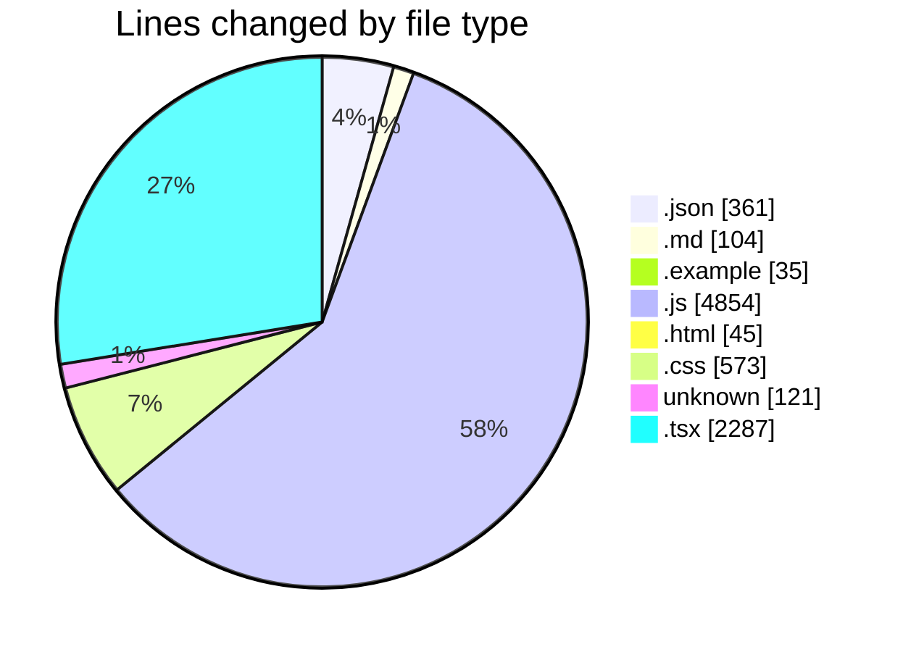
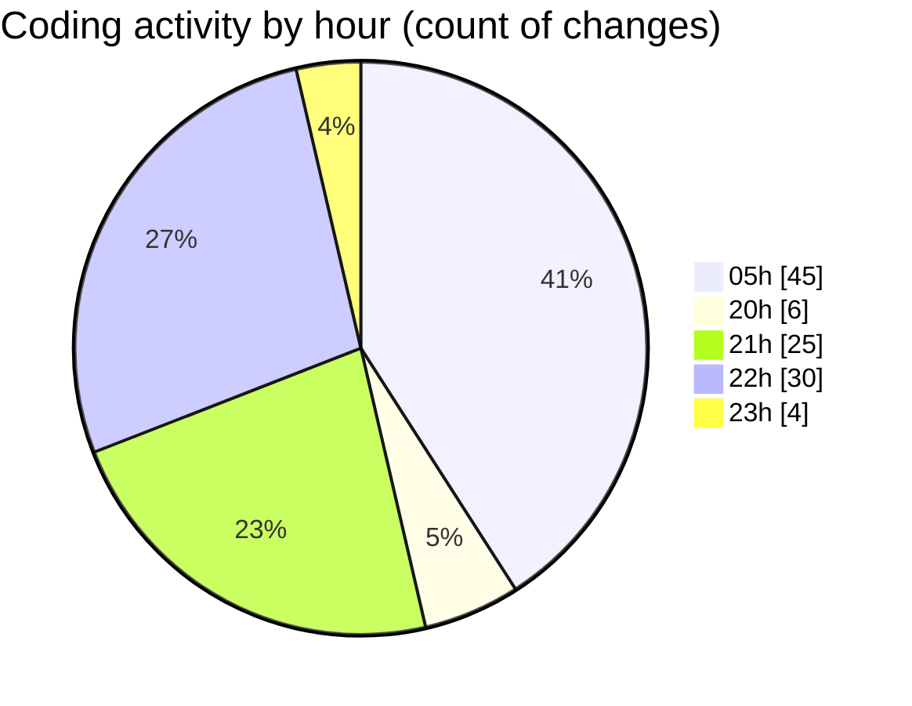

# napXUVN - Activity Summary 

## Overall Statistics

| Stat                   | Value                                                             |
| ---------------------- | ----------------------------------------------------------------- |
| **Lines Added** (➕)   | 8235                                          |
| **Lines Removed** (➖) | 145                                        |
| **Net Change** (↕)    | 8090                |
| **Active Time** (⌚)   | 120 minutes |

## Modified Files
- **package.json** (+20, -0)
- **README.md** (+104, -0)
- **package.json** (+35, -0)
- **env.example** (+35, -0)
- **server.js** (+116, -0)
- **User.js** (+172, -0)
- **Transaction.js** (+223, -0)
- **auth.js** (+147, -0)
- **errorHandler.js** (+82, -0)
- **auth.js** (+306, -0)
- **package.json** (+58, -0)
- **index.html** (+45, -0)
- **index.js** (+52, -0)
- **index.css** (+306, -0)
- **tailwind.config.js** (+213, -0)
- **package.json** (+62, -0)
- **users.js** (+262, -0)
- **payment.js** (+316, -0)
- **admin.js** (+451, -0)
- **transactions.js** (+103, -0)
- **App.js** (+100, -0)
- **AuthContext.js** (+223, -0)
- **.gitignore** (+121, -0)
- **next.config.js** (+19, -0)
- **tsconfig.json** (+28, -0)
- **tailwind.config.js** (+63, -0)
- **layout.tsx** (+65, -0)
- **globals.css** (+127, -0)
- **page.tsx** (+239, -0)
- **AuthProvider.tsx** (+140, -0)
- **Header.tsx** (+172, -0)
- **Footer.tsx** (+148, -0)
- **page.tsx** (+165, -0)
- **package.json** (+63, -19)
- **next.config.js** (+16, -0)
- **layout.tsx** (+65, -0)
- **globals.css** (+129, -11)
- **page.tsx** (+299, -0)
- **AuthProvider.tsx** (+119, -0)
- **Header.tsx** (+190, -0)
- **Footer.tsx** (+124, -0)
- **tsconfig.json** (+40, -0)
- **tailwind.config.js** (+229, -0)
- **page.tsx** (+216, -0)
- **page.tsx** (+345, -0)
- **RechargePackage.js** (+208, -0)
- **PaymentMethod.js** (+216, -0)
- **Promotion.js** (+272, -0)
- **database.js** (+251, -115)
- **server.js** (+122, -0)
- **seedData.js** (+261, -0)
- **package.json** (+36, -0)
- **payment.js** (+316, -0)

## Visualizations

### By File Type (Lines Changed)

### By Hour (Estimated Activity Count)

> **Last Updated:** 8/5/2025, 11:29:23 PM