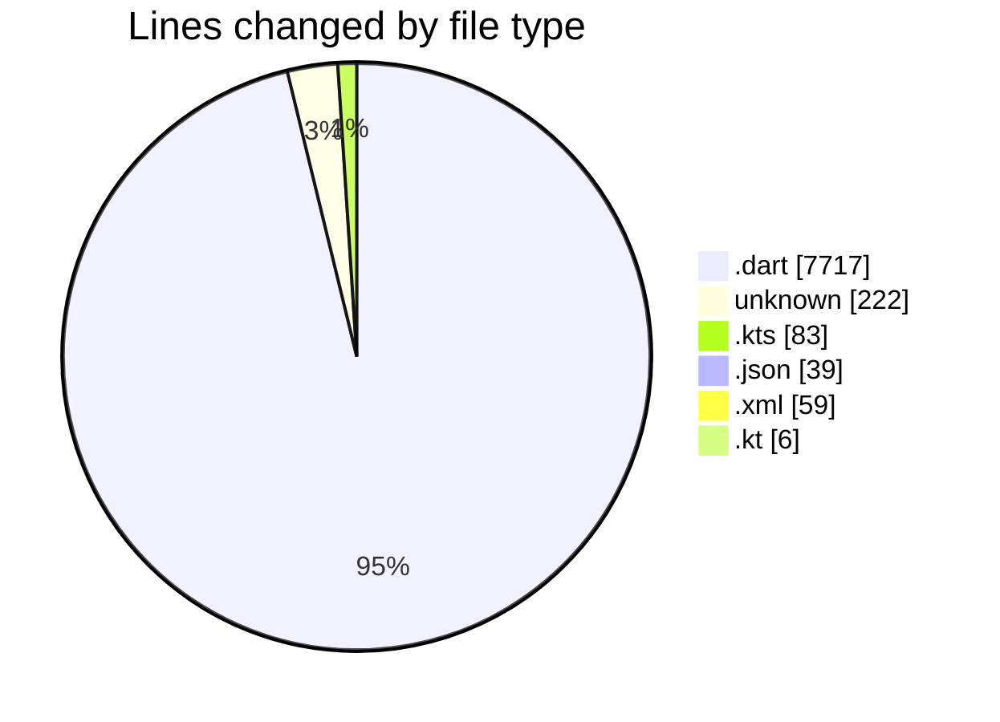
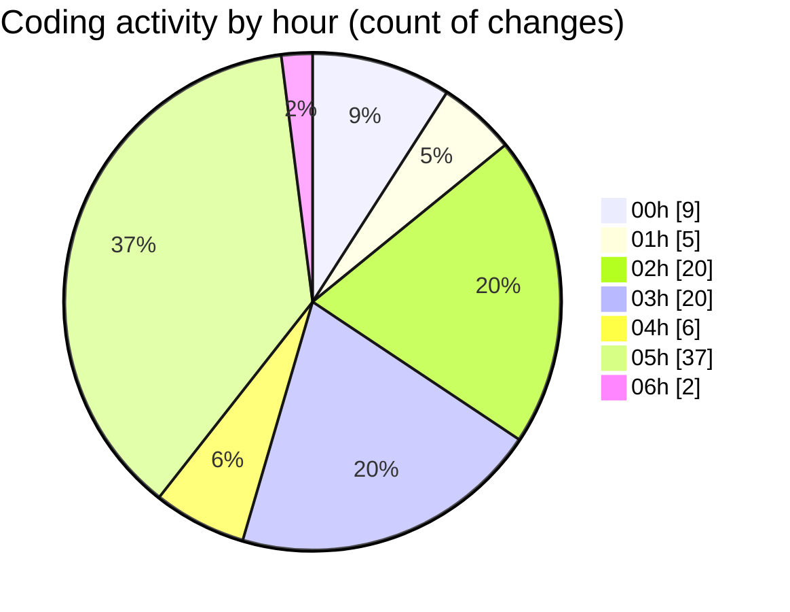

# studyBuddy - Activity Summary 

## Overall Statistics

| Stat                   | Value                                                             |
| ---------------------- | ----------------------------------------------------------------- |
| **Lines Added** (➕)   | 7821                                          |
| **Lines Removed** (➖) | 305                                        |
| **Net Change** (↕)    | 7516                |
| **Active Time** (⌚)   | 122 minutes |

## Modified Files
- **sync_service.dart** (+33, -0)
- **study_target_repository.dart** (+112, -0)
- **study_target_provider.dart** (+23, -0)
- **study_target.dart** (+47, -0)
- **profile_screen.dart** (+19, -0)
- **sync_settings_screen.dart** (+523, -1)
- **security_settings_screen.dart** (+633, -0)
- **main_screen.dart** (+271, -6)
- **tasks_screen.dart** (+963, -0)
- **dashboard_screen.dart** (+777, -0)
- **calendar_screen.dart** (+707, -0)
- **notification_service.dart** (+805, -27)
- **notification_settings_screen.dart** (+514, -0)
- **.gitignore** (+218, -4)
- **firebase_options.dart** (+87, -9)
- **build.gradle.kts** (+32, -0)
- **build.gradle.kts** (+51, -0)
- **google-services.json** (+39, -0)
- **main.dart** (+186, -0)
- **firebase_service.dart** (+128, -7)
- **auth_service.dart** (+187, -0)
- **firebase_auth_service.dart** (+370, -166)
- **auth_provider.dart** (+291, -32)
- **login_screen.dart** (+340, -13)
- **signup_screen.dart** (+400, -40)
- **AndroidManifest.xml** (+59, -0)
- **MainActivity.kt** (+6, -0)

## Visualizations

### By File Type (Lines Changed)

### By Hour (Estimated Activity Count)

> **Last Updated:** 8/5/2025, 6:02:49 AM