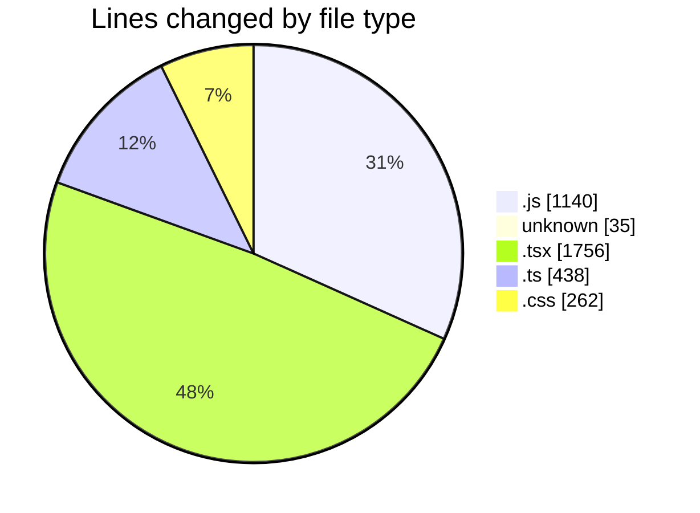

# napXUVN - Activity Summary 

## Overall Statistics

| Stat                   | Value                                                             |
| ---------------------- | ----------------------------------------------------------------- |
| **Lines Added** (➕)   | 3037                                          |
| **Lines Removed** (➖) | 594                                        |
| **Net Change** (↕)    | 2443                |
| **Active Time** (⌚)   | 79 minutes |

## Modified Files
- **seedData.js** (+131, -0)
- **.env** (+35, -0)
- **packages.js** (+230, -0)
- **promotions.js** (+295, -0)
- **paymentMethods.js** (+234, -0)
- **server.js** (+8, -0)
- **adminAuth.js** (+23, -0)
- **dashboard.js** (+219, -0)
- **layout.tsx** (+0, -15)
- **Button.tsx** (+82, -0)
- **AuthContext.tsx** (+125, -0)
- **Card.tsx** (+59, -0)
- **ThemeContext.tsx** (+77, -0)
- **Input.tsx** (+105, -0)
- **user.ts** (+36, -0)
- **index.ts** (+3, -0)
- **package.ts** (+49, -0)
- **FeatureCard.tsx** (+35, -0)
- **promotion.ts** (+55, -0)
- **PackageCard.tsx** (+72, -0)
- **SectionHeader.tsx** (+30, -0)
- **payment.ts** (+88, -0)
- **index.ts** (+3, -0)
- **authService.ts** (+59, -0)
- **HeroSection.tsx** (+57, -0)
- **apiClient.ts** (+69, -0)
- **FeaturesSection.tsx** (+54, -0)
- **PackagesSection.tsx** (+52, -0)
- **CTASection.tsx** (+36, -0)
- **Header.tsx** (+0, -78)
- **index.ts** (+4, -0)
- **components.module.css** (+105, -0)
- **layout.module.css** (+157, -0)
- **index.ts** (+2, -0)
- **Footer.tsx** (+5, -0)
- **page.tsx** (+239, -222)
- **Button.tsx** (+53, -0)
- **utils.ts** (+55, -0)
- **index.ts** (+15, -0)
- **Logo.tsx** (+41, -0)
- **ThemeToggle.tsx** (+40, -0)
- **page.tsx** (+0, -279)

## Visualizations

### By File Type (Lines Changed)

### By Hour (Estimated Activity Count)

> **Last Updated:** 8/6/2025, 12:24:23 AM