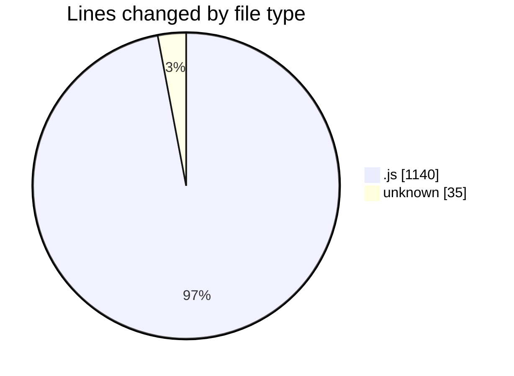
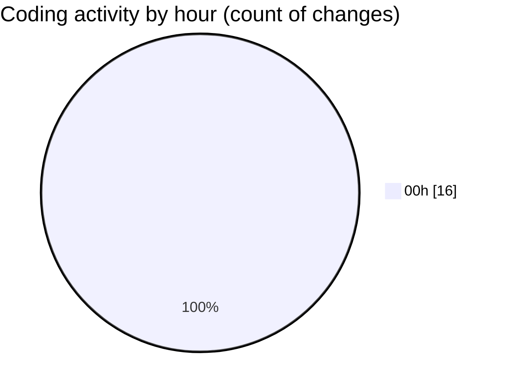

# napXUVN - Activity Summary 

## Overall Statistics

| Stat                   | Value                                                             |
| ---------------------- | ----------------------------------------------------------------- |
| **Lines Added** (➕)   | 1175                                          |
| **Lines Removed** (➖) | 0                                        |
| **Net Change** (↕)    | 1175                |
| **Active Time** (⌚)   | 16 minutes |

## Modified Files
- **seedData.js** (+131, -0)
- **.env** (+35, -0)
- **packages.js** (+230, -0)
- **promotions.js** (+295, -0)
- **paymentMethods.js** (+234, -0)
- **server.js** (+8, -0)
- **adminAuth.js** (+23, -0)
- **dashboard.js** (+219, -0)

## Visualizations

### By File Type (Lines Changed)

### By Hour (Estimated Activity Count)

> **Last Updated:** 8/6/2025, 12:14:23 AM