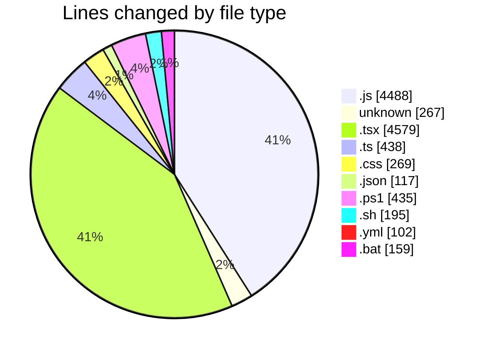
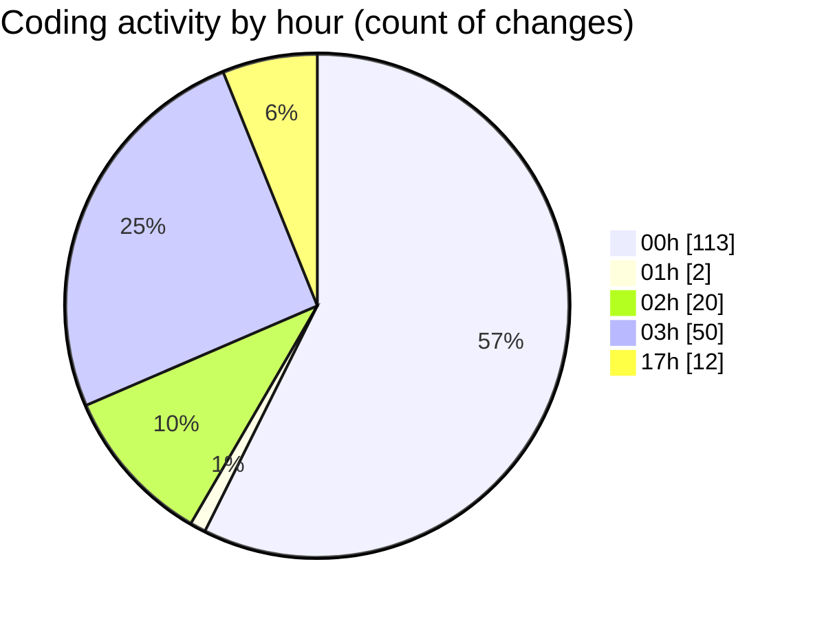

# napXUVN - Activity Summary 

## Overall Statistics

| Stat                   | Value                                                             |
| ---------------------- | ----------------------------------------------------------------- |
| **Lines Added** (➕)   | 10136                                          |
| **Lines Removed** (➖) | 913                                        |
| **Net Change** (↕)    | 9223                |
| **Active Time** (⌚)   | 198 minutes |

## Modified Files
- **seedData.js** (+131, -0)
- **.env** (+35, -0)
- **packages.js** (+230, -0)
- **promotions.js** (+295, -0)
- **paymentMethods.js** (+234, -0)
- **server.js** (+109, -0)
- **adminAuth.js** (+23, -0)
- **dashboard.js** (+219, -0)
- **layout.tsx** (+79, -42)
- **Button.tsx** (+82, -0)
- **AuthContext.tsx** (+125, -0)
- **Card.tsx** (+59, -0)
- **ThemeContext.tsx** (+77, -0)
- **Input.tsx** (+105, -0)
- **user.ts** (+36, -0)
- **index.ts** (+3, -0)
- **package.ts** (+49, -0)
- **FeatureCard.tsx** (+35, -0)
- **promotion.ts** (+55, -0)
- **PackageCard.tsx** (+72, -0)
- **SectionHeader.tsx** (+30, -0)
- **payment.ts** (+88, -0)
- **index.ts** (+3, -0)
- **authService.ts** (+59, -0)
- **HeroSection.tsx** (+57, -0)
- **apiClient.ts** (+69, -0)
- **FeaturesSection.tsx** (+54, -0)
- **PackagesSection.tsx** (+52, -0)
- **CTASection.tsx** (+36, -0)
- **Header.tsx** (+0, -78)
- **index.ts** (+4, -0)
- **components.module.css** (+105, -0)
- **layout.module.css** (+157, -0)
- **index.ts** (+2, -0)
- **Footer.tsx** (+5, -0)
- **page.tsx** (+239, -222)
- **Button.tsx** (+53, -0)
- **utils.ts** (+55, -0)
- **index.ts** (+15, -0)
- **Logo.tsx** (+41, -0)
- **ThemeToggle.tsx** (+40, -0)
- **page.tsx** (+175, -279)
- **Hero.tsx** (+218, -0)
- **globals.css** (+7, -0)
- **UserMenu.tsx** (+85, -0)
- **MobileMenu.tsx** (+124, -0)
- **Toaster.tsx** (+35, -0)
- **FeaturedPackages.tsx** (+126, -0)
- **HowItWorks.tsx** (+103, -0)
- **Features.tsx** (+96, -0)
- **Testimonials.tsx** (+124, -0)
- **CTASection.tsx** (+75, -0)
- **package.json** (+64, -8)
- **Makefile** (+113, -0)
- **dev.ps1** (+123, -0)
- **dev.sh** (+195, -0)
- **docker-compose.dev.yml** (+102, -0)
- **dev.bat** (+159, -0)
- **AuthContext.js** (+225, -224)
- **AuthProvider.tsx** (+119, -2)
- **dev.ps1** (+101, -50)
- **dev.ps1** (+25, -0)
- **dev-all.ps1** (+68, -0)
- **start-frontend.ps1** (+43, -0)
- **start-backend.ps1** (+25, -0)
- **package.json** (+42, -0)
- **User.js** (+203, -0)
- **Transaction.js** (+165, -0)
- **RechargePackage.js** (+149, -0)
- **auth.js** (+359, -0)
- **auth.js** (+104, -0)
- **packages.js** (+302, -0)
- **users.js** (+317, -0)
- **transactions.js** (+286, -0)
- **payments.js** (+296, -0)
- **promotions.js** (+340, -0)
- **notifications.js** (+66, -0)
- **admin.js** (+100, -0)
- **support.js** (+111, -0)
- **page.tsx** (+108, -0)
- **page.tsx** (+174, -0)
- **page.tsx** (+186, -0)
- **layout.tsx** (+35, -8)
- **page.tsx** (+217, -0)
- **page.tsx** (+194, -0)
- **.gitignore** (+119, -0)
- **package.json** (+3, -0)
- **page.tsx** (+216, -0)
- **page.tsx** (+113, -0)
- **page.tsx** (+153, -0)
- **page.tsx** (+13, -0)
- **page.tsx** (+18, -0)

## Visualizations

### By File Type (Lines Changed)

### By Hour (Estimated Activity Count)

> **Last Updated:** 8/6/2025, 6:02:19 PM