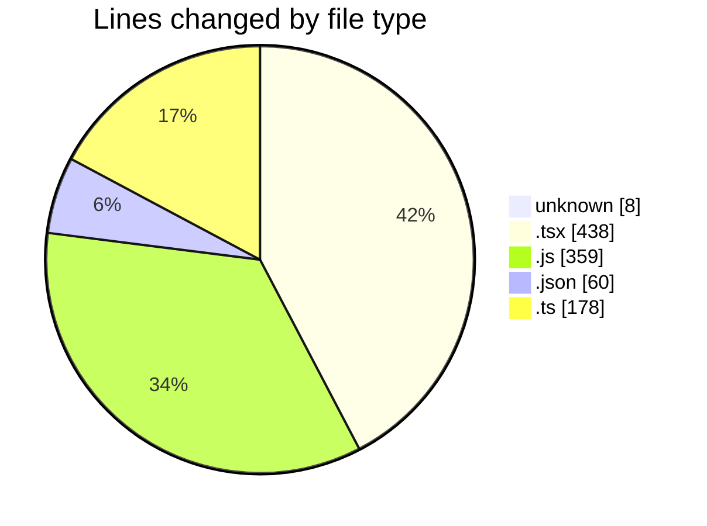
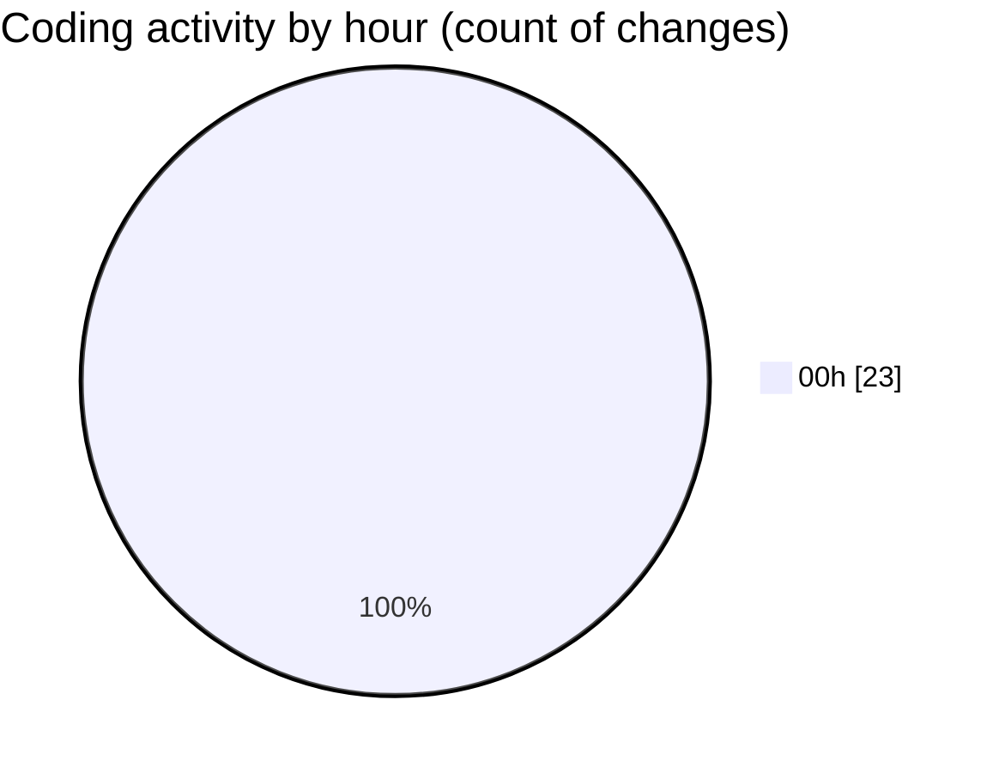

# napXUVN - Activity Summary 

## Overall Statistics

| Stat                   | Value                                                             |
| ---------------------- | ----------------------------------------------------------------- |
| **Lines Added** (➕)   | 1037                                          |
| **Lines Removed** (➖) | 6                                        |
| **Net Change** (↕)    | 1031                |
| **Active Time** (⌚)   | 27 minutes |

## Modified Files
- **.env** (+8, -0)
- **layout.tsx** (+27, -0)
- **page.tsx** (+217, -0)
- **page.tsx** (+194, -0)
- **auth.js** (+359, -0)
- **tsconfig.json** (+30, -0)
- **tsconfig.json** (+30, -0)
- **environment.ts** (+82, -0)
- **next.config.ts** (+18, -3)
- **next.config.ts** (+18, -3)
- **environment.ts** (+45, -0)
- **shared-config.ts** (+9, -0)

## Visualizations

### By File Type (Lines Changed)

### By Hour (Estimated Activity Count)

> **Last Updated:** 8/7/2025, 12:17:31 AM