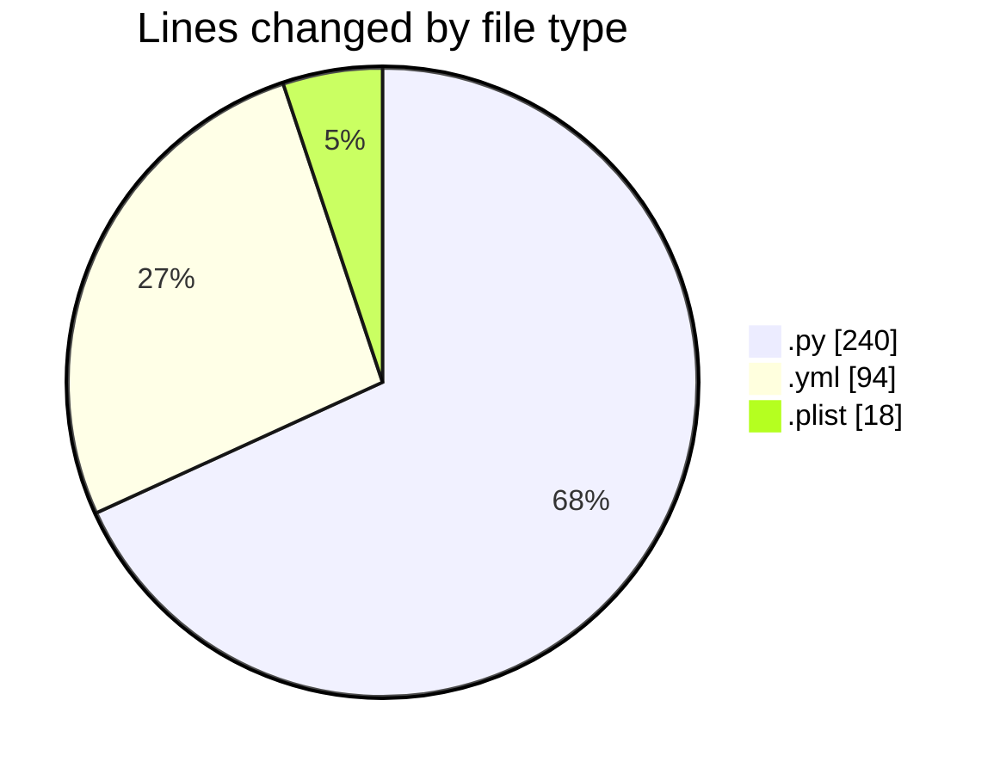
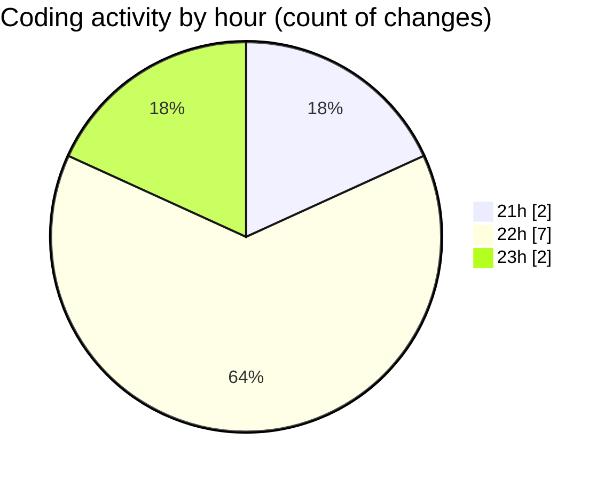

# studyBuddy - Activity Summary 

## Overall Statistics

| Stat                   | Value                                                             |
| ---------------------- | ----------------------------------------------------------------- |
| **Lines Added** (➕)   | 339                                          |
| **Lines Removed** (➖) | 13                                        |
| **Net Change** (↕)    | 326                |
| **Active Time** (⌚)   | 6 minutes |

## Modified Files
- **build_ios_windows.py** (+240, -0)
- **ios.yml** (+47, -13)
- **android.yml** (+34, -0)
- **ExportOptions.plist** (+18, -0)

## Visualizations

### By File Type (Lines Changed)

### By Hour (Estimated Activity Count)

> **Last Updated:** 8/7/2025, 11:32:54 PM