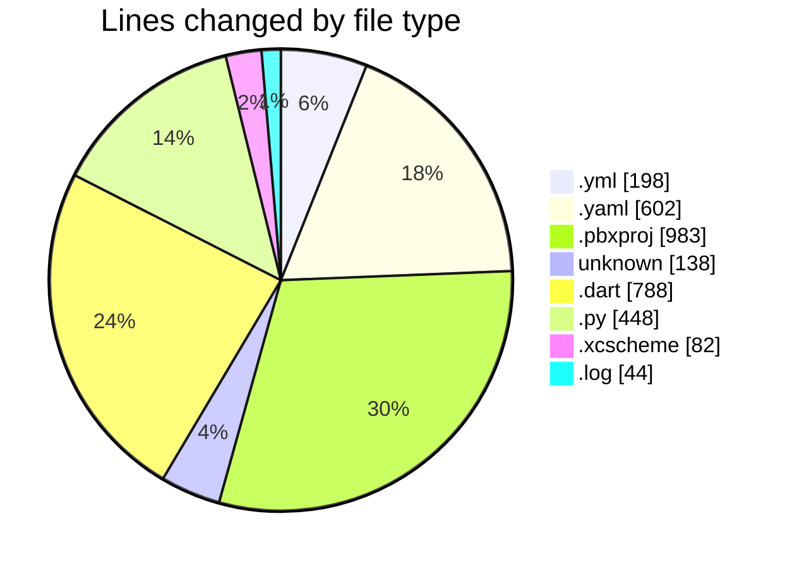
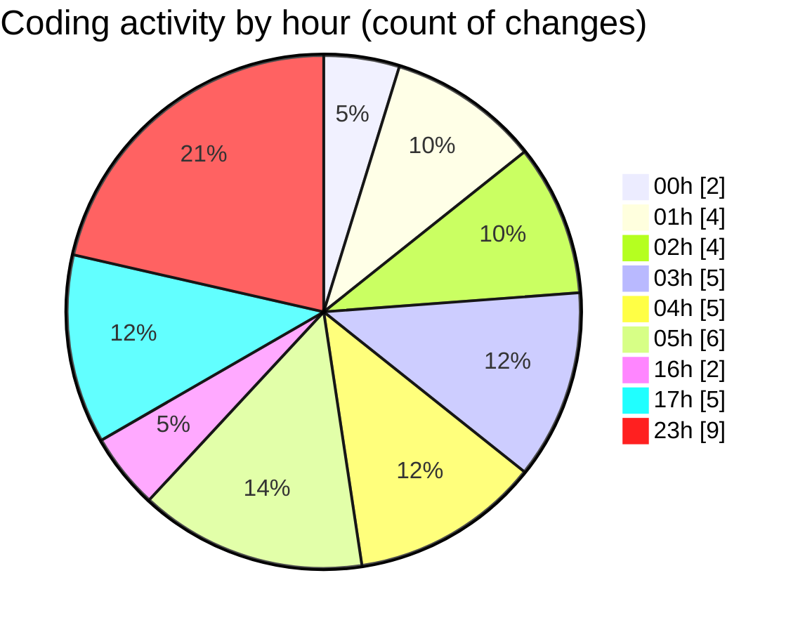

# studyBuddy - Activity Summary 

## Overall Statistics

| Stat                   | Value                                                             |
| ---------------------- | ----------------------------------------------------------------- |
| **Lines Added** (➕)   | 2990                                          |
| **Lines Removed** (➖) | 293                                        |
| **Net Change** (↕)    | 2697                |
| **Active Time** (⌚)   | 22 minutes |

## Modified Files
- **ios.yml** (+64, -50)
- **android.yml** (+43, -41)
- **pubspec.yaml** (+325, -162)
- **project.pbxproj** (+983, -0)
- **Podfile** (+108, -30)
- **codemagic.yaml** (+115, -0)
- **notification_service.dart** (+785, -3)
- **check_ios_setup.py** (+192, -0)
- **fix_codemagic_ios.py** (+256, -0)
- **Runner.xcscheme** (+82, -0)
- **building_ios (3).log** (+37, -7)

## Visualizations

### By File Type (Lines Changed)

### By Hour (Estimated Activity Count)

> **Last Updated:** 8/8/2025, 11:26:58 PM