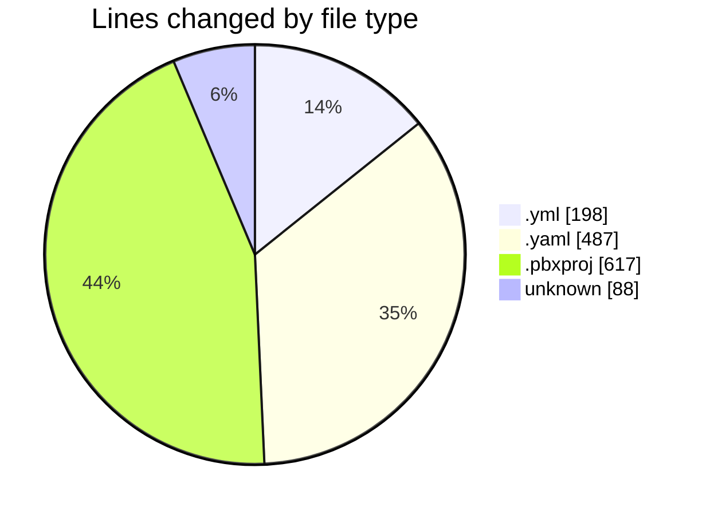
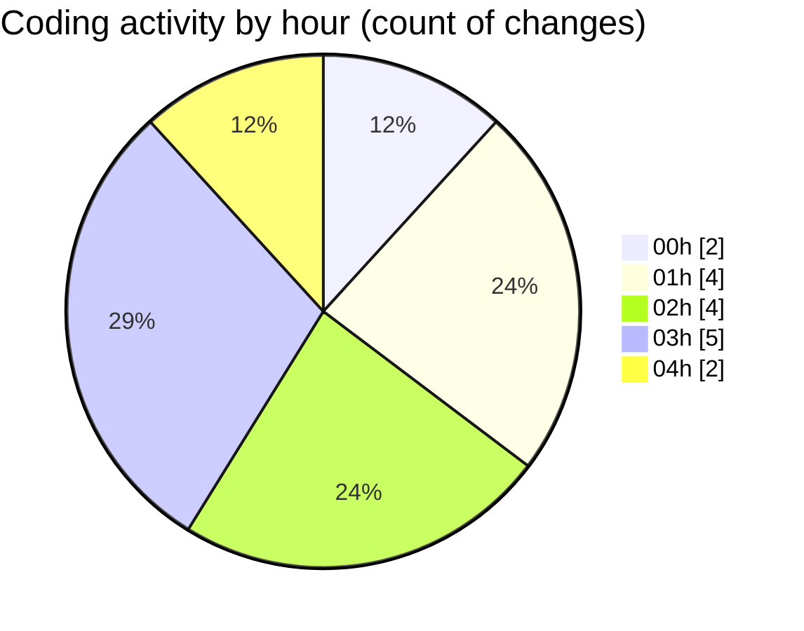

# studyBuddy - Activity Summary 

## Overall Statistics

| Stat                   | Value                                                             |
| ---------------------- | ----------------------------------------------------------------- |
| **Lines Added** (➕)   | 1127                                          |
| **Lines Removed** (➖) | 263                                        |
| **Net Change** (↕)    | 864                |
| **Active Time** (⌚)   | 7 minutes |

## Modified Files
- **ios.yml** (+64, -50)
- **android.yml** (+43, -41)
- **pubspec.yaml** (+325, -162)
- **project.pbxproj** (+617, -0)
- **Podfile** (+78, -10)

## Visualizations

### By File Type (Lines Changed)

### By Hour (Estimated Activity Count)

> **Last Updated:** 8/8/2025, 4:27:55 AM