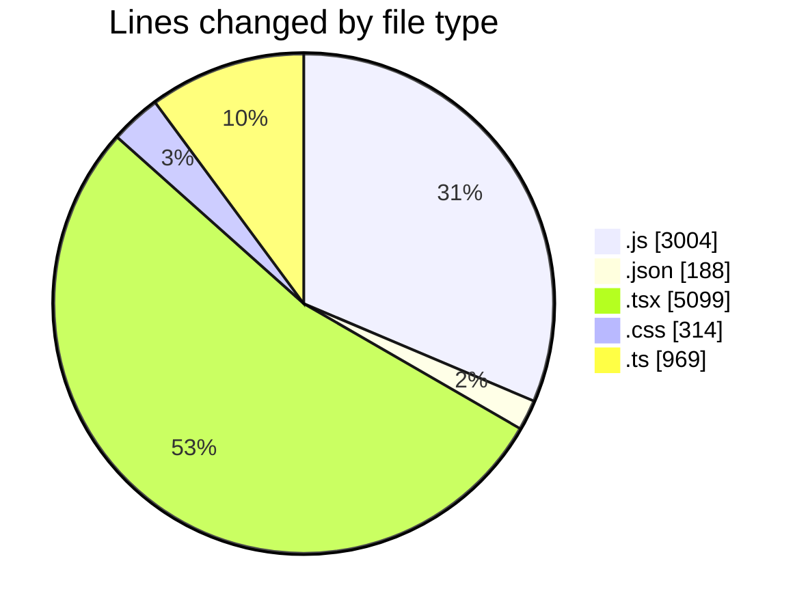
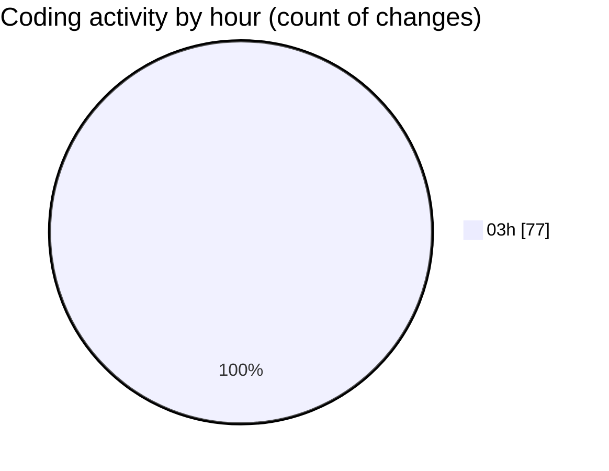

# napXUVN - Activity Summary 

## Overall Statistics

| Stat                   | Value                                                             |
| ---------------------- | ----------------------------------------------------------------- |
| **Lines Added** (➕)   | 9333                                          |
| **Lines Removed** (➖) | 241                                        |
| **Net Change** (↕)    | 9092                |
| **Active Time** (⌚)   | 77 minutes |

## Modified Files
- **next.config.js** (+19, -0)
- **tsconfig.json** (+28, -0)
- **tailwind.config.js** (+63, -0)
- **layout.tsx** (+65, -0)
- **globals.css** (+127, -0)
- **page.tsx** (+239, -0)
- **AuthProvider.tsx** (+140, -0)
- **Header.tsx** (+172, -0)
- **Footer.tsx** (+148, -0)
- **page.tsx** (+165, -0)
- **page.tsx** (+320, -0)
- **package.json** (+40, -0)
- **postcss.config.js** (+6, -0)
- **page.tsx** (+332, -0)
- **page.tsx** (+384, -0)
- **package.json** (+44, -0)
- **next.config.js** (+16, -0)
- **layout.tsx** (+65, -0)
- **globals.css** (+118, -0)
- **page.tsx** (+299, -148)
- **AuthProvider.tsx** (+119, -0)
- **Header.tsx** (+190, -0)
- **Footer.tsx** (+124, -0)
- **tsconfig.json** (+40, -0)
- **tailwind.config.js** (+229, -0)
- **page.tsx** (+216, -26)
- **page.tsx** (+345, -67)
- **PaymentMethod.js** (+216, -0)
- **Promotion.js** (+272, -0)
- **database.js** (+136, -0)
- **package.json** (+36, -0)
- **payment.js** (+316, -0)
- **server.js** (+130, -0)
- **RechargePackage.js** (+208, -0)
- **paymentMethods.js** (+234, -0)
- **packages.js** (+230, -0)
- **promotions.js** (+295, -0)
- **dashboard.js** (+219, -0)
- **seedData.js** (+392, -0)
- **adminAuth.js** (+23, -0)
- **index.ts** (+204, -0)
- **index.ts** (+322, -0)
- **client.ts** (+168, -0)
- **index.ts** (+145, -0)
- **Button.tsx** (+74, -0)
- **Card.tsx** (+51, -0)
- **Input.tsx** (+74, -0)
- **Modal.tsx** (+93, -0)
- **Header.tsx** (+253, -0)
- **Footer.tsx** (+233, -0)
- **useAuth.ts** (+126, -0)
- **index.ts** (+4, -0)
- **buttons.css** (+69, -0)
- **page.tsx** (+393, -0)
- **page.tsx** (+364, -0)

## Visualizations

### By File Type (Lines Changed)

### By Hour (Estimated Activity Count)

> **Last Updated:** 8/9/2025, 3:41:59 AM