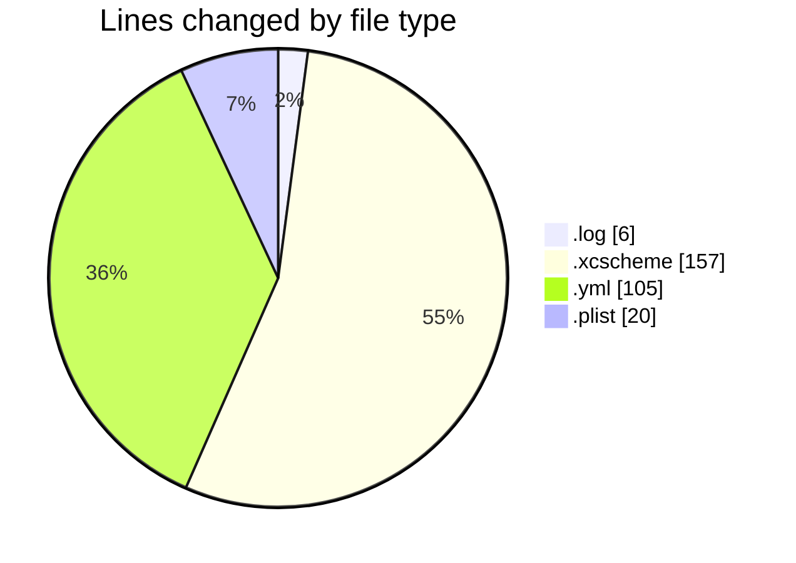
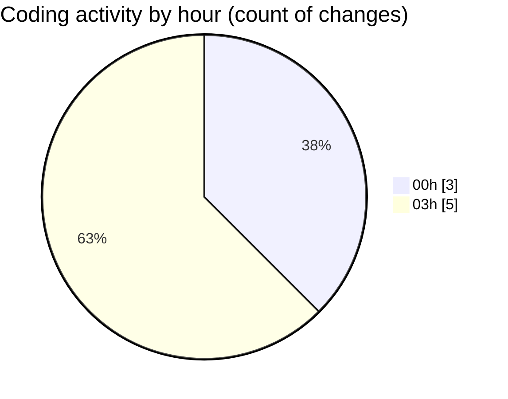

# studyBuddy - Activity Summary 

## Overall Statistics

| Stat                   | Value                                                             |
| ---------------------- | ----------------------------------------------------------------- |
| **Lines Added** (➕)   | 207                                          |
| **Lines Removed** (➖) | 81                                        |
| **Net Change** (↕)    | 126                |
| **Active Time** (⌚)   | 6 minutes |

## Modified Files
- **building_ios (3).log** (+6, -0)
- **Runner.xcscheme** (+76, -81)
- **ios_framework.yml** (+51, -0)
- **ios_testflight.yml** (+54, -0)
- **ExportOptions.plist** (+20, -0)

## Visualizations

### By File Type (Lines Changed)

### By Hour (Estimated Activity Count)

> **Last Updated:** 8/9/2025, 3:11:59 AM