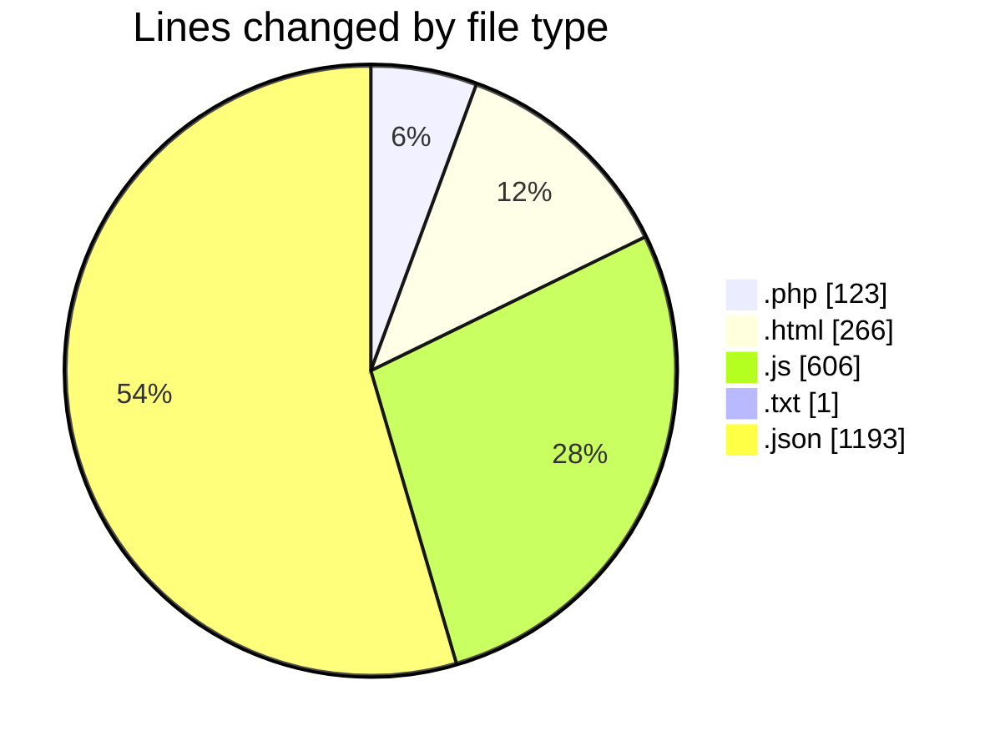
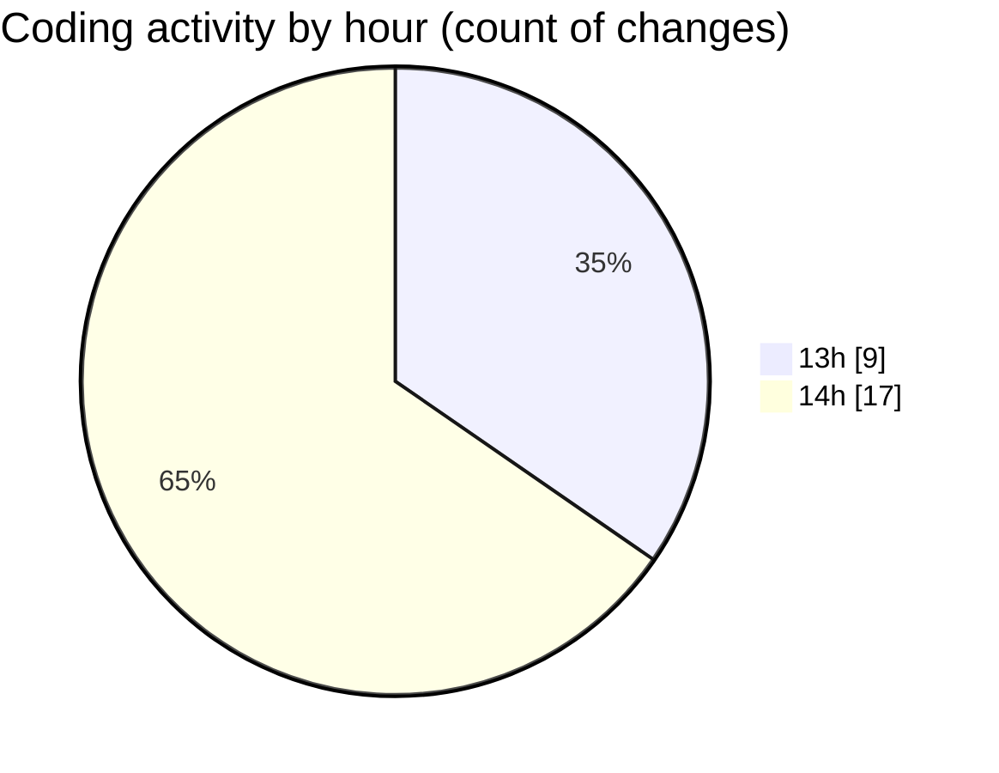

# getMailOTP - Activity Summary 

## Overall Statistics

| Stat                   | Value                                                             |
| ---------------------- | ----------------------------------------------------------------- |
| **Lines Added** (➕)   | 1731                                          |
| **Lines Removed** (➖) | 458                                        |
| **Net Change** (↕)    | 1273                |
| **Active Time** (⌚)   | 37 minutes |

## Modified Files
- **getmail.php** (+123, -0)
- **formmail.html** (+266, -0)
- **index.js** (+376, -175)
- **latest_otp.txt** (+1, -0)
- **package.json** (+22, -3)
- **package-lock.json** (+888, -280)
- **ok.js** (+55, -0)

## Visualizations

### By File Type (Lines Changed)

### By Hour (Estimated Activity Count)

> **Last Updated:** 8/10/2025, 2:27:31 PM