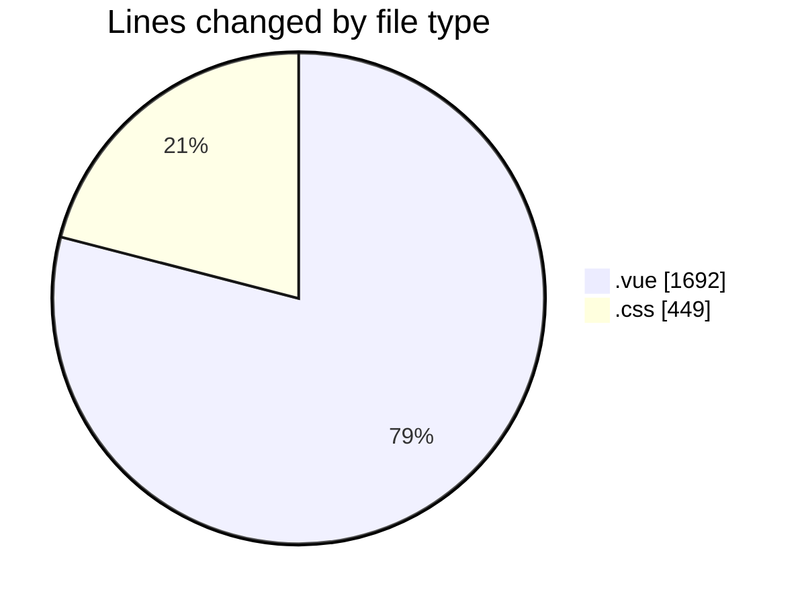
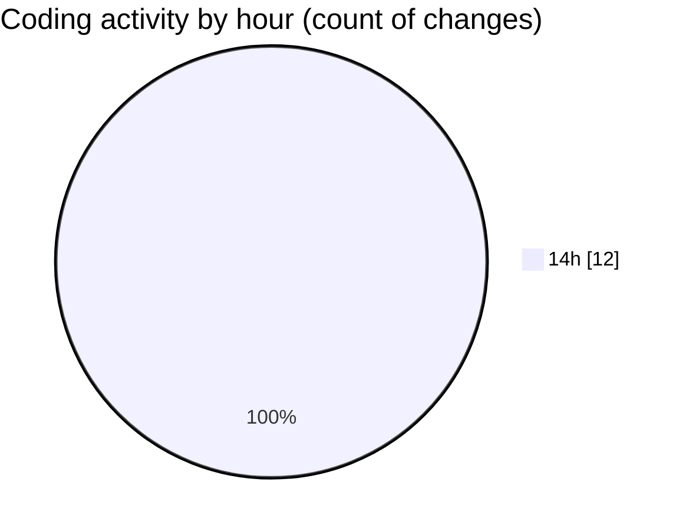

# rentOTP - Activity Summary 

## Overall Statistics

| Stat                   | Value                                                             |
| ---------------------- | ----------------------------------------------------------------- |
| **Lines Added** (➕)   | 2124                                          |
| **Lines Removed** (➖) | 17                                        |
| **Net Change** (↕)    | 2107                |
| **Active Time** (⌚)   | 19 minutes |

## Modified Files
- **Client.vue** (+256, -0)
- **Dashboard.vue** (+391, -0)
- **RentOTP.vue** (+455, -0)
- **index.css** (+432, -17)
- **History.vue** (+590, -0)

## Visualizations

### By File Type (Lines Changed)

### By Hour (Estimated Activity Count)

> **Last Updated:** 8/10/2025, 3:00:14 PM