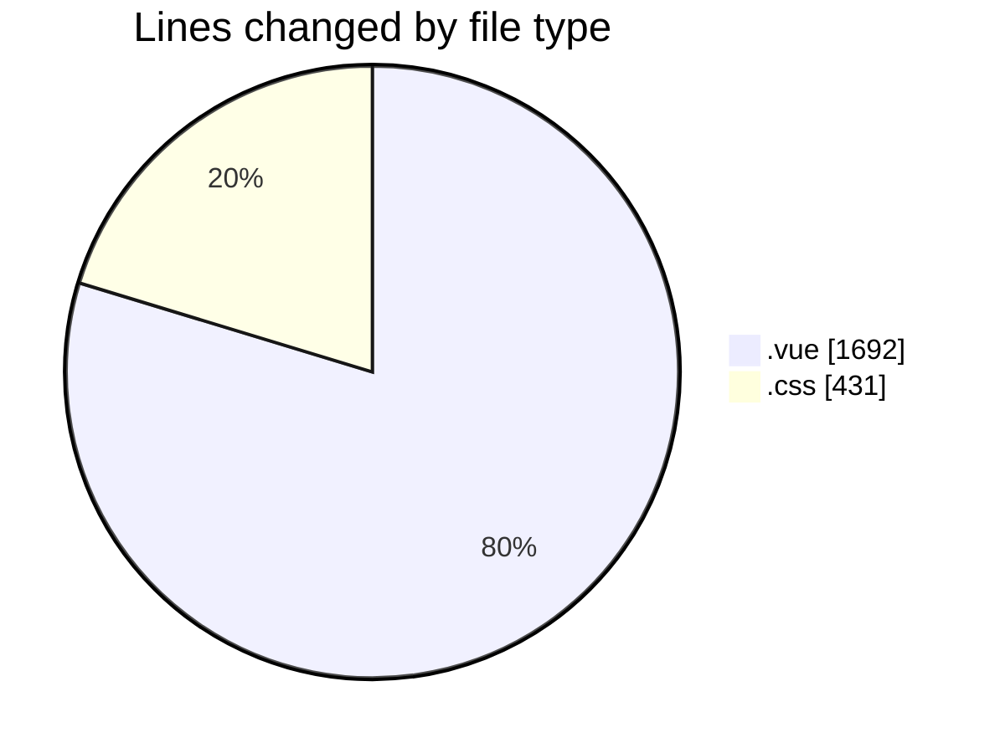

# rentOTP - Activity Summary 

## Overall Statistics

| Stat                   | Value                                                             |
| ---------------------- | ----------------------------------------------------------------- |
| **Lines Added** (➕)   | 2123                                          |
| **Lines Removed** (➖) | 0                                        |
| **Net Change** (↕)    | 2123                |
| **Active Time** (⌚)   | 15 minutes |

## Modified Files
- **Client.vue** (+256, -0)
- **Dashboard.vue** (+391, -0)
- **RentOTP.vue** (+455, -0)
- **index.css** (+431, -0)
- **History.vue** (+590, -0)

## Visualizations

### By File Type (Lines Changed)

### By Hour (Estimated Activity Count)

> **Last Updated:** 8/10/2025, 2:50:14 PM