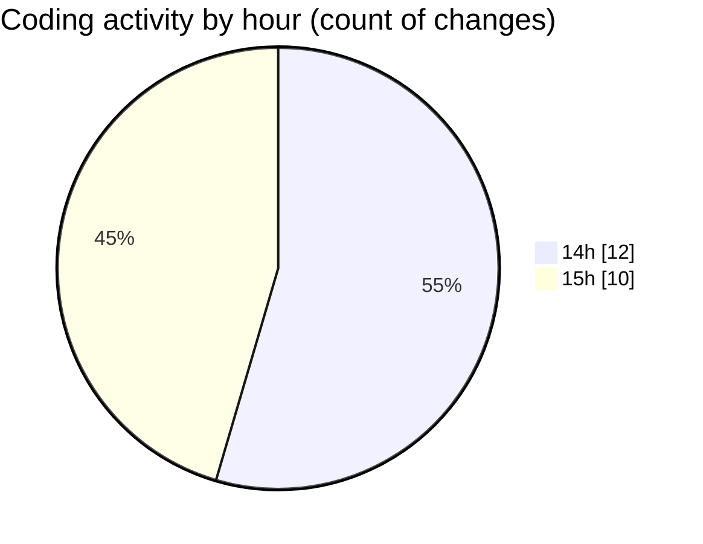

# rentOTP - Activity Summary 

## Overall Statistics

| Stat                   | Value                                                             |
| ---------------------- | ----------------------------------------------------------------- |
| **Lines Added** (➕)   | 2230                                          |
| **Lines Removed** (➖) | 36                                        |
| **Net Change** (↕)    | 2194                |
| **Active Time** (⌚)   | 28 minutes |

## Modified Files
- **Client.vue** (+308, -7)
- **Dashboard.vue** (+418, -6)
- **RentOTP.vue** (+455, -0)
- **index.css** (+432, -17)
- **History.vue** (+617, -6)

## Visualizations

### By File Type (Lines Changed)

### By Hour (Estimated Activity Count)

> **Last Updated:** 8/10/2025, 3:10:14 PM