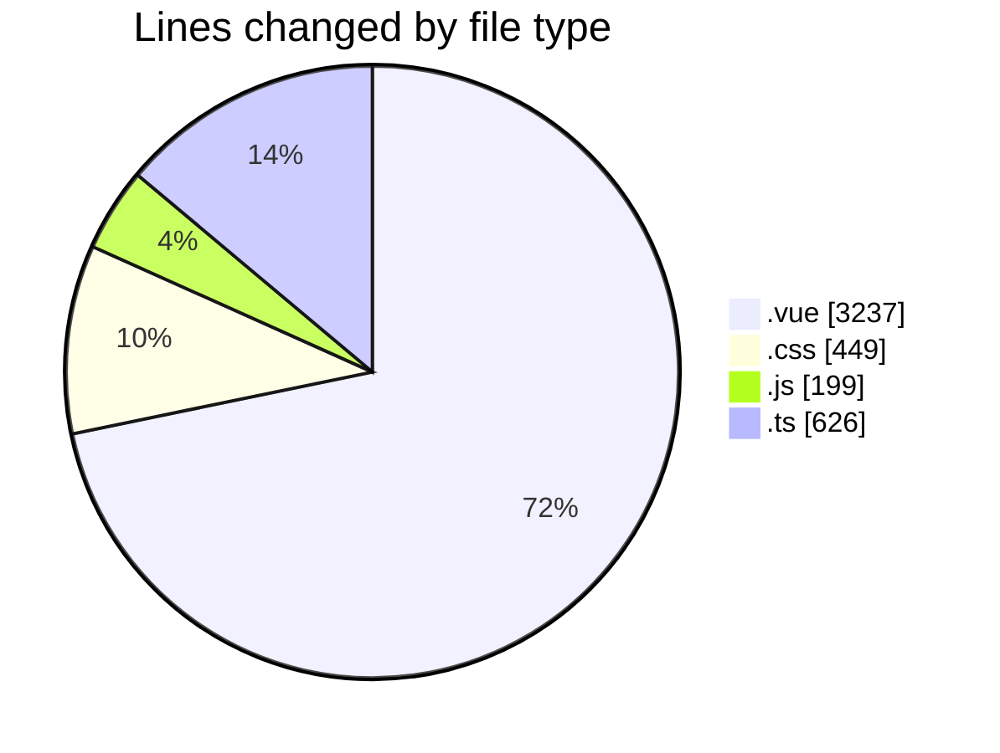
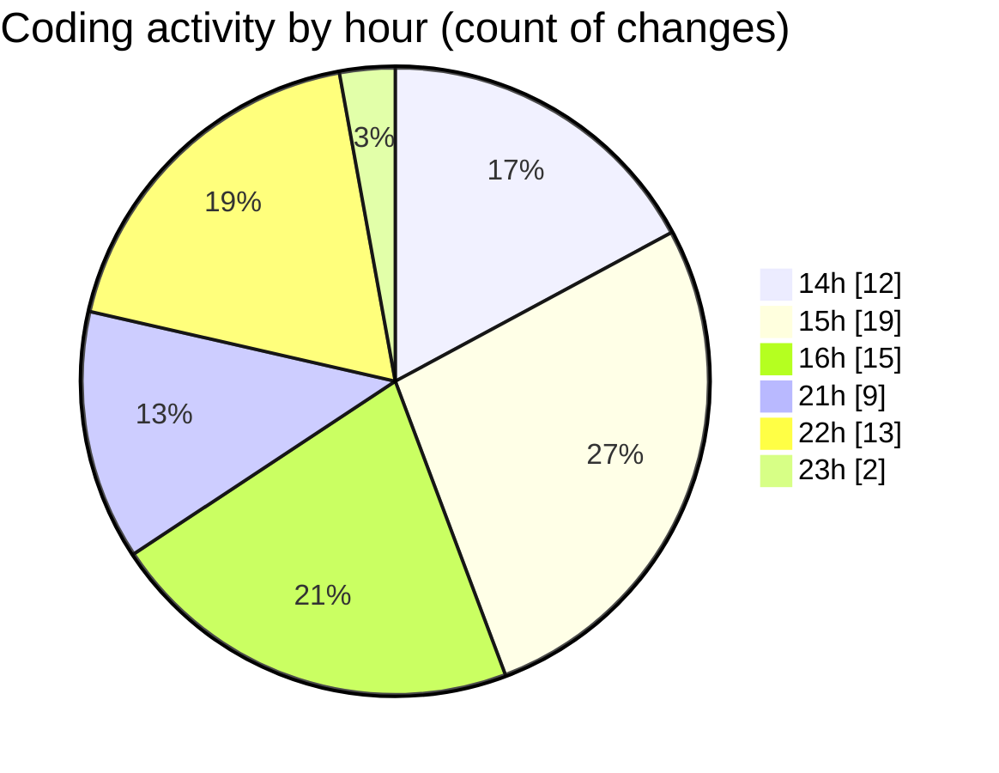

# rentOTP - Activity Summary 

## Overall Statistics

| Stat                   | Value                                                             |
| ---------------------- | ----------------------------------------------------------------- |
| **Lines Added** (➕)   | 3858                                          |
| **Lines Removed** (➖) | 653                                        |
| **Net Change** (↕)    | 3205                |
| **Active Time** (⌚)   | 75 minutes |

## Modified Files
- **Client.vue** (+308, -7)
- **Dashboard.vue** (+719, -318)
- **RentOTP.vue** (+455, -30)
- **index.css** (+432, -17)
- **History.vue** (+617, -36)
- **main.js** (+199, -0)
- **Profile.vue** (+679, -68)
- **user.schema.ts** (+66, -0)
- **client.service.ts** (+359, -177)
- **main.ts** (+24, -0)

## Visualizations

### By File Type (Lines Changed)

### By Hour (Estimated Activity Count)

> **Last Updated:** 8/10/2025, 11:30:15 PM