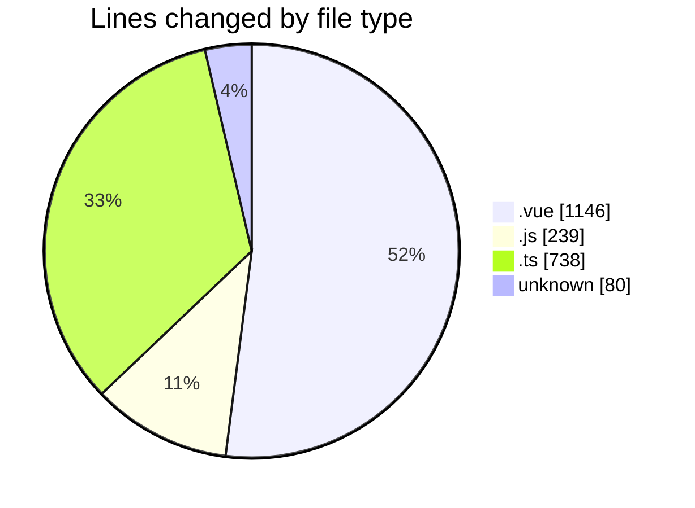
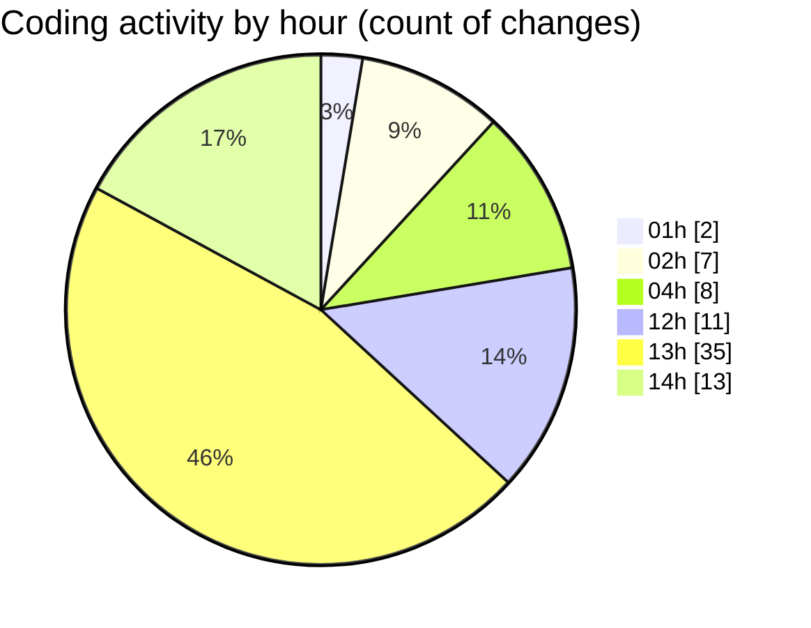

# rentOTP - Activity Summary 

## Overall Statistics

| Stat                   | Value                                                             |
| ---------------------- | ----------------------------------------------------------------- |
| **Lines Added** (➕)   | 2110                                          |
| **Lines Removed** (➖) | 93                                        |
| **Net Change** (↕)    | 2017                |
| **Active Time** (⌚)   | 77 minutes |

## Modified Files
- **Profile.vue** (+795, -42)
- **Dashboard.vue** (+50, -0)
- **apiService.js** (+47, -0)
- **api.js** (+86, -0)
- **main.ts** (+35, -0)
- **.env** (+54, -26)
- **user.seed.ts** (+102, -10)
- **jwt.strategy.ts** (+38, -15)
- **client.controller.ts** (+58, -0)
- **update-password.js** (+60, -0)
- **check-db.js** (+46, -0)
- **client.service.ts** (+210, -0)
- **update-profile.dto.ts** (+14, -0)
- **user.schema.ts** (+66, -0)
- **auth.service.ts** (+190, -0)
- **Register.vue** (+259, -0)

## Visualizations

### By File Type (Lines Changed)

### By Hour (Estimated Activity Count)

> **Last Updated:** 8/11/2025, 2:30:12 PM