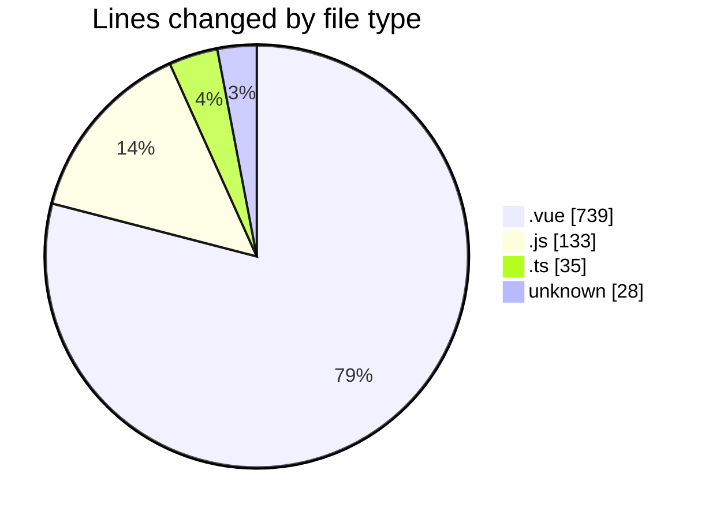
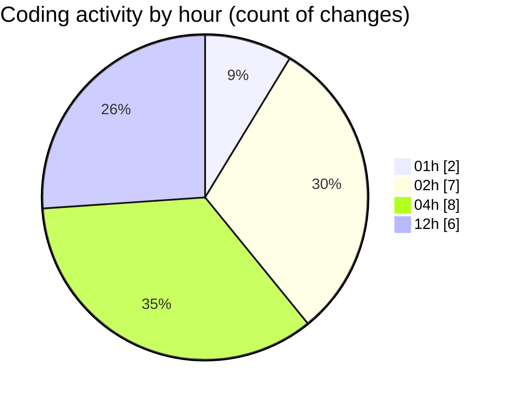

# rentOTP - Activity Summary 

## Overall Statistics

| Stat                   | Value                                                             |
| ---------------------- | ----------------------------------------------------------------- |
| **Lines Added** (➕)   | 923                                          |
| **Lines Removed** (➖) | 12                                        |
| **Net Change** (↕)    | 911                |
| **Active Time** (⌚)   | 23 minutes |

## Modified Files
- **Profile.vue** (+677, -12)
- **Dashboard.vue** (+50, -0)
- **apiService.js** (+47, -0)
- **api.js** (+86, -0)
- **main.ts** (+35, -0)
- **.env** (+28, -0)

## Visualizations

### By File Type (Lines Changed)

### By Hour (Estimated Activity Count)

> **Last Updated:** 8/11/2025, 12:50:12 PM