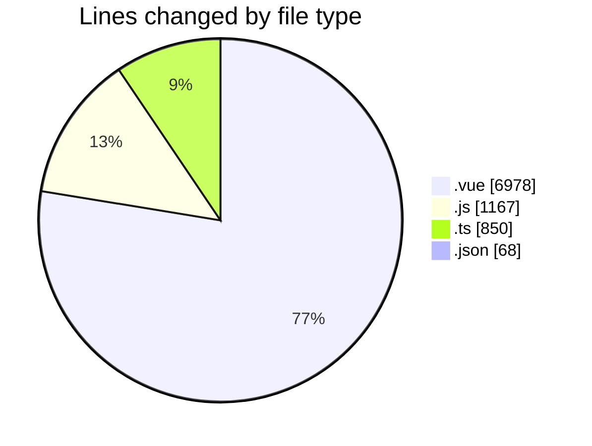
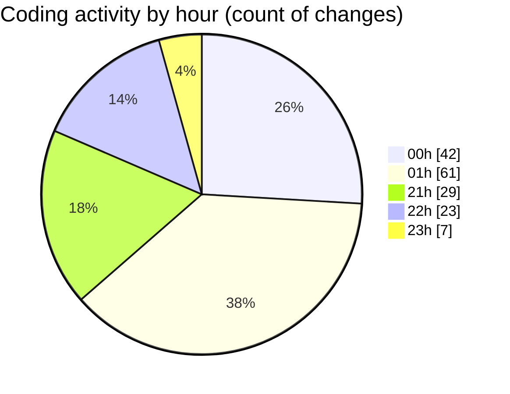

# rentOTP - Activity Summary 

## Overall Statistics

| Stat                   | Value                                                             |
| ---------------------- | ----------------------------------------------------------------- |
| **Lines Added** (➕)   | 8931                                          |
| **Lines Removed** (➖) | 132                                        |
| **Net Change** (↕)    | 8799                |
| **Active Time** (⌚)   | 208 minutes |

## Modified Files
- **Deposit.vue** (+191, -0)
- **apiService.js** (+629, -31)
- **deposit.controller.ts** (+43, -0)
- **deposit.service.ts** (+158, -0)
- **Client.vue** (+317, -0)
- **History.vue** (+706, -0)
- **otp.controller.ts** (+42, -0)
- **otp.service.ts** (+256, -0)
- **api.js** (+2, -0)
- **RentOTP.vue** (+689, -8)
- **rent-otp.dto.ts** (+20, -0)
- **otp-order.schema.ts** (+56, -0)
- **Dashboard.vue** (+589, -0)
- **Settings.vue** (+1262, -0)
- **MailServices.vue** (+498, -0)
- **MailManagement.vue** (+697, -0)
- **package.json** (+68, -0)
- **main.js** (+199, -0)
- **auth.guard.js** (+123, -24)
- **UserDropdown.vue** (+184, -25)
- **Sidebar.vue** (+480, -26)
- **Dashboard.vue** (+597, -2)
- **roleUtils.js** (+159, -0)
- **Profile.vue** (+691, -16)
- **client.service.ts** (+210, -0)
- **client.controller.ts** (+65, -0)

## Visualizations

### By File Type (Lines Changed)

### By Hour (Estimated Activity Count)

> **Last Updated:** 8/12/2025, 10:30:02 PM