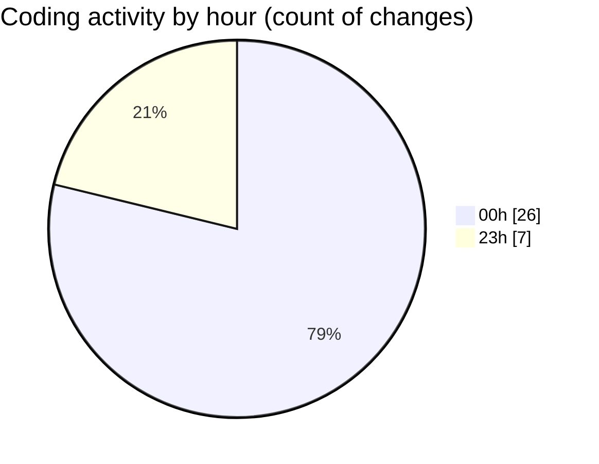

# rentOTP - Activity Summary 

## Overall Statistics

| Stat                   | Value                                                             |
| ---------------------- | ----------------------------------------------------------------- |
| **Lines Added** (➕)   | 1769                                          |
| **Lines Removed** (➖) | 0                                        |
| **Net Change** (↕)    | 1769                |
| **Active Time** (⌚)   | 36 minutes |

## Modified Files
- **Deposit.vue** (+191, -0)
- **apiService.js** (+95, -0)
- **deposit.controller.ts** (+43, -0)
- **deposit.service.ts** (+158, -0)
- **Client.vue** (+317, -0)
- **History.vue** (+706, -0)
- **otp.controller.ts** (+42, -0)
- **otp.service.ts** (+216, -0)
- **api.js** (+1, -0)

## Visualizations

### By File Type (Lines Changed)

### By Hour (Estimated Activity Count)

> **Last Updated:** 8/12/2025, 12:45:57 AM