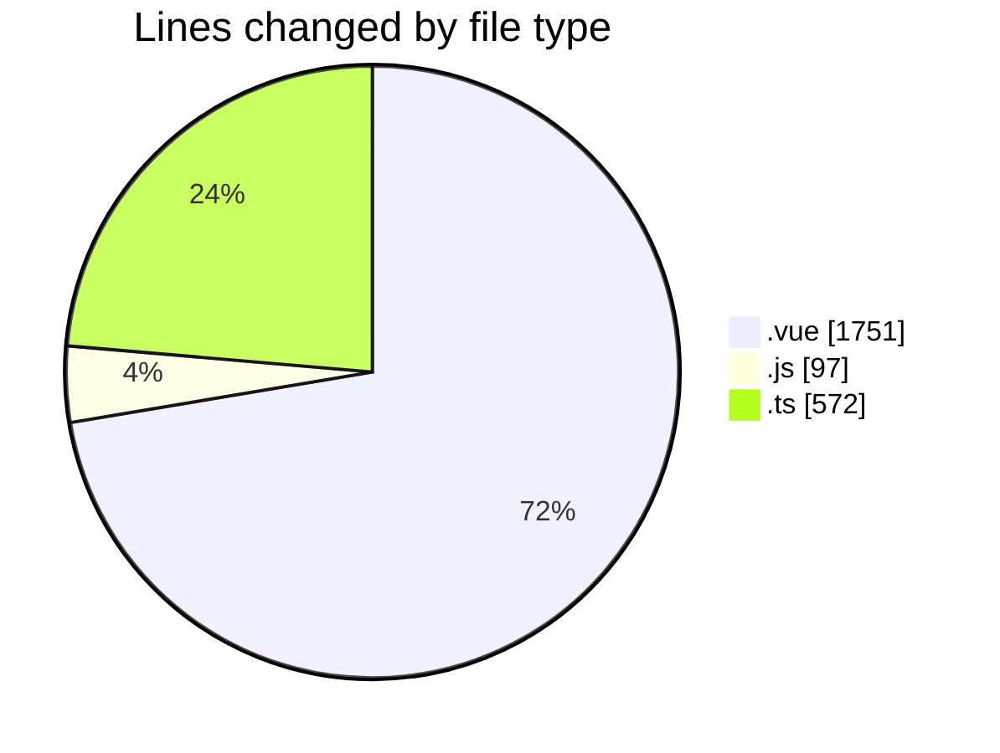
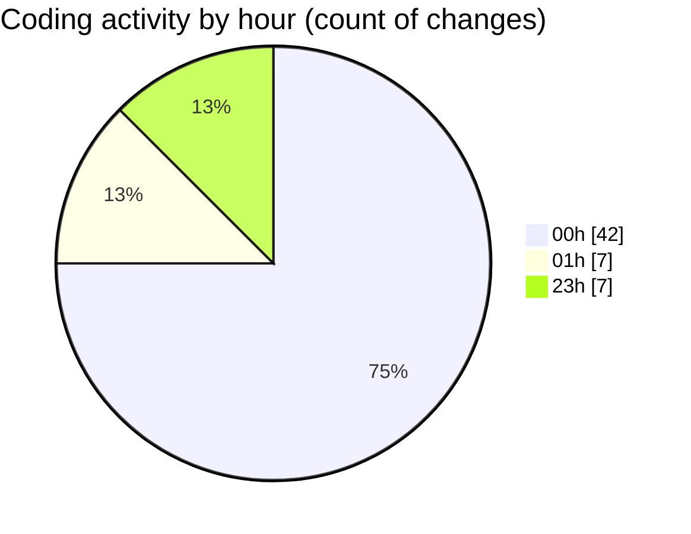

# rentOTP - Activity Summary 

## Overall Statistics

| Stat                   | Value                                                             |
| ---------------------- | ----------------------------------------------------------------- |
| **Lines Added** (➕)   | 2412                                          |
| **Lines Removed** (➖) | 8                                        |
| **Net Change** (↕)    | 2404                |
| **Active Time** (⌚)   | 62 minutes |

## Modified Files
- **Deposit.vue** (+191, -0)
- **apiService.js** (+96, -0)
- **deposit.controller.ts** (+43, -0)
- **deposit.service.ts** (+158, -0)
- **Client.vue** (+317, -0)
- **History.vue** (+706, -0)
- **otp.controller.ts** (+42, -0)
- **otp.service.ts** (+253, -0)
- **api.js** (+1, -0)
- **RentOTP.vue** (+529, -8)
- **rent-otp.dto.ts** (+20, -0)
- **otp-order.schema.ts** (+56, -0)

## Visualizations

### By File Type (Lines Changed)

### By Hour (Estimated Activity Count)

> **Last Updated:** 8/12/2025, 1:15:57 AM