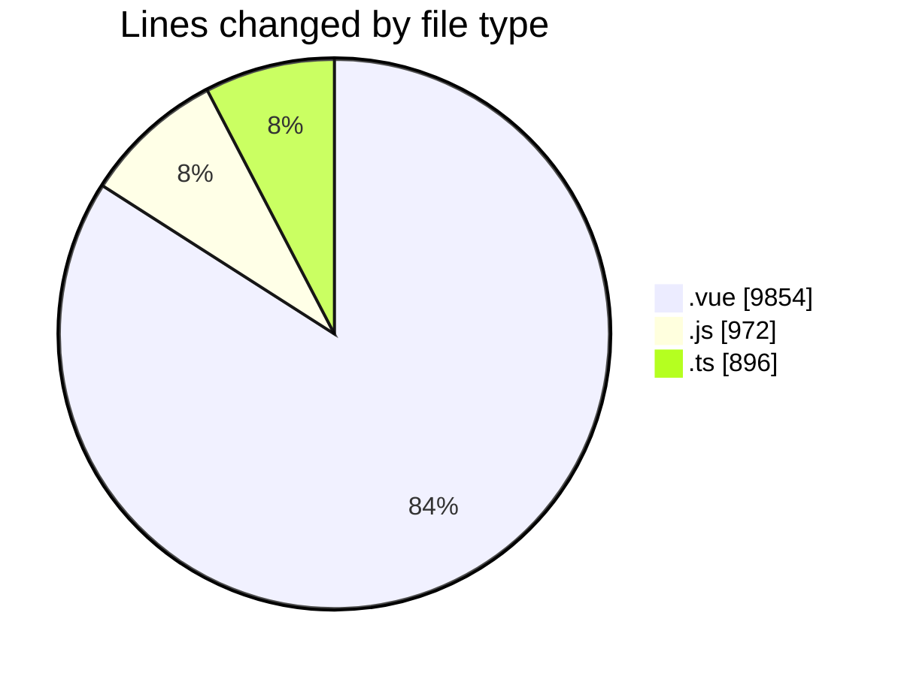
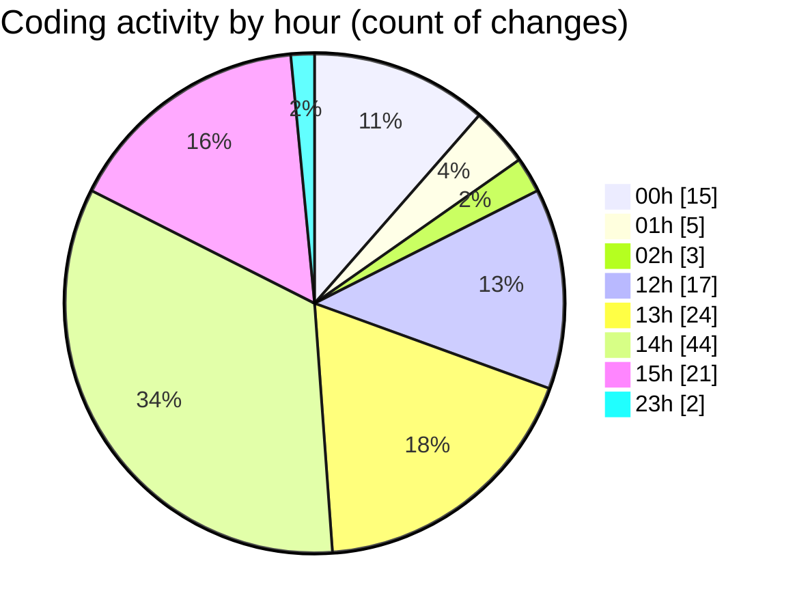

# rentOTP - Activity Summary 

## Overall Statistics

| Stat                   | Value                                                             |
| ---------------------- | ----------------------------------------------------------------- |
| **Lines Added** (➕)   | 10006                                          |
| **Lines Removed** (➖) | 1716                                        |
| **Net Change** (↕)    | 8290                |
| **Active Time** (⌚)   | 171 minutes |

## Modified Files
- **Admin.vue** (+473, -231)
- **Dashboard.vue** (+636, -10)
- **Users.vue** (+1807, -699)
- **Orders.vue** (+1025, -0)
- **MailServices.vue** (+813, -183)
- **main.js** (+235, -9)
- **AdminSidebar.vue** (+1007, -397)
- **ClientSidebar.vue** (+423, -3)
- **Client.vue** (+179, -177)
- **Deposit.vue** (+914, -3)
- **HeaderStats.vue** (+12, -0)
- **admin.controller.ts** (+141, -0)
- **admin.service.ts** (+704, -0)
- **admin.module.ts** (+23, -0)
- **app.module.ts** (+28, -0)
- **apiService.js** (+366, -0)
- **roleUtils.js** (+173, -0)
- **api.js** (+88, -0)
- **auth.guard.js** (+99, -2)
- **Login.vue** (+187, -2)
- **Profile.vue** (+673, -0)

## Visualizations

### By File Type (Lines Changed)

### By Hour (Estimated Activity Count)

> **Last Updated:** 8/13/2025, 3:29:13 PM