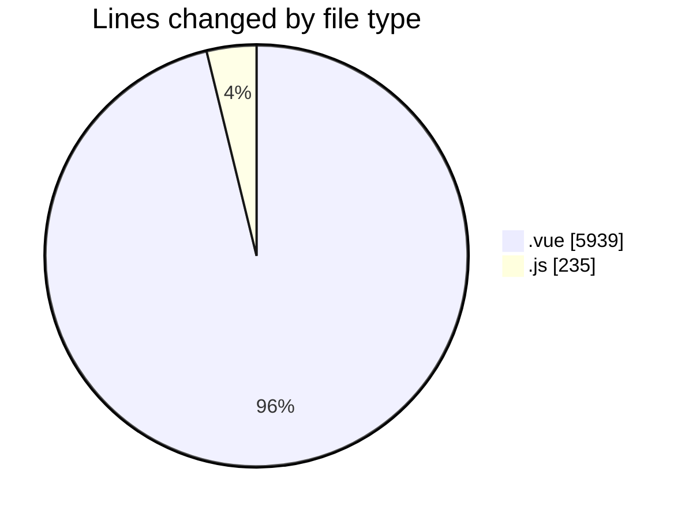
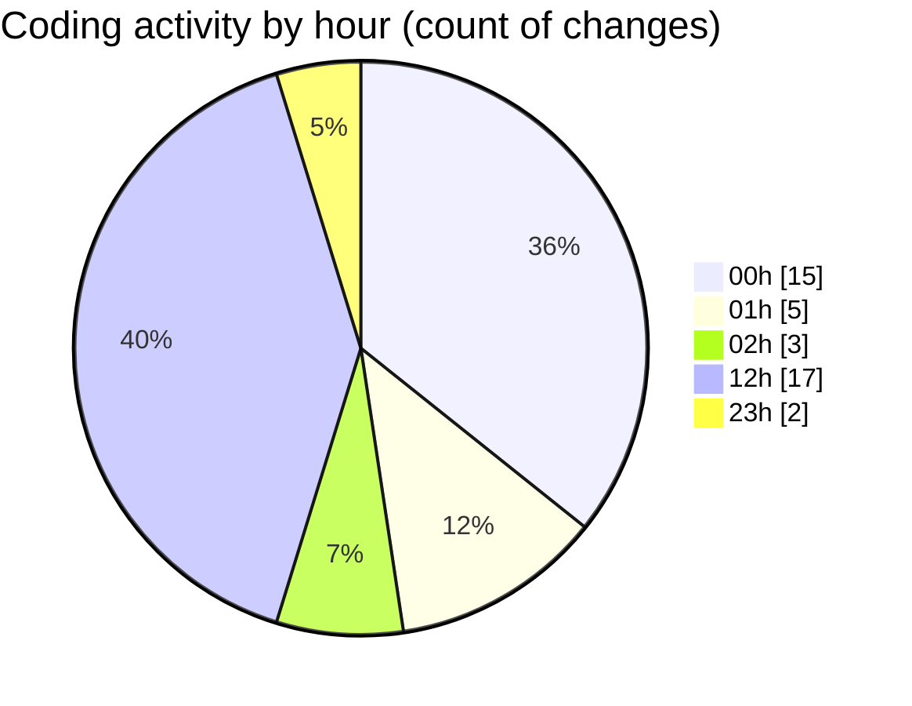

# rentOTP - Activity Summary 

## Overall Statistics

| Stat                   | Value                                                             |
| ---------------------- | ----------------------------------------------------------------- |
| **Lines Added** (➕)   | 5213                                          |
| **Lines Removed** (➖) | 961                                        |
| **Net Change** (↕)    | 4252                |
| **Active Time** (⌚)   | 67 minutes |

## Modified Files
- **Admin.vue** (+473, -231)
- **Dashboard.vue** (+605, -0)
- **Users.vue** (+462, -0)
- **Orders.vue** (+626, -0)
- **MailServices.vue** (+813, -183)
- **main.js** (+235, -0)
- **AdminSidebar.vue** (+859, -367)
- **ClientSidebar.vue** (+214, -3)
- **Client.vue** (+0, -177)
- **Deposit.vue** (+914, -0)
- **HeaderStats.vue** (+12, -0)

## Visualizations

### By File Type (Lines Changed)

### By Hour (Estimated Activity Count)

> **Last Updated:** 8/13/2025, 12:59:12 PM