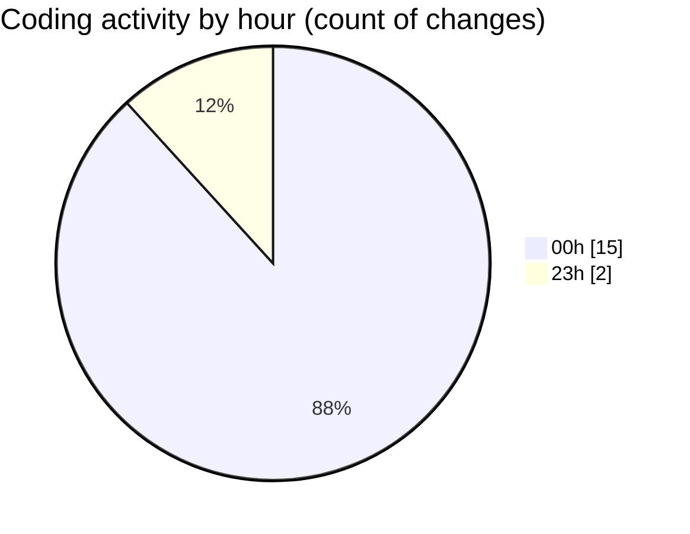

# rentOTP - Activity Summary 

## Overall Statistics

| Stat                   | Value                                                             |
| ---------------------- | ----------------------------------------------------------------- |
| **Lines Added** (➕)   | 1695                                          |
| **Lines Removed** (➖) | 443                                        |
| **Net Change** (↕)    | 1252                |
| **Active Time** (⌚)   | 28 minutes |

## Modified Files
- **Admin.vue** (+162, -80)
- **Dashboard.vue** (+18, -0)
- **Users.vue** (+231, -0)
- **Orders.vue** (+313, -0)
- **MailServices.vue** (+498, -183)
- **main.js** (+18, -0)
- **AdminSidebar.vue** (+241, -0)
- **ClientSidebar.vue** (+214, -3)
- **Client.vue** (+0, -177)

## Visualizations

### By File Type (Lines Changed)

### By Hour (Estimated Activity Count)

> **Last Updated:** 8/13/2025, 1:00:02 AM