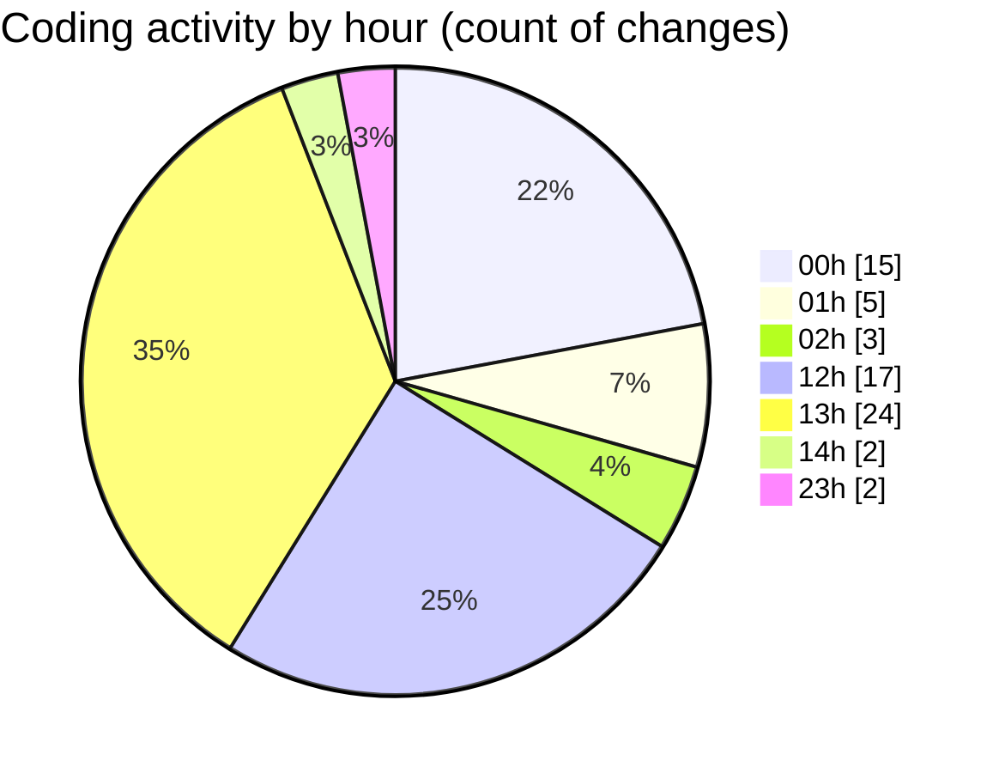

# rentOTP - Activity Summary 

## Overall Statistics

| Stat                   | Value                                                             |
| ---------------------- | ----------------------------------------------------------------- |
| **Lines Added** (➕)   | 6618                                          |
| **Lines Removed** (➖) | 1000                                        |
| **Net Change** (↕)    | 5618                |
| **Active Time** (⌚)   | 97 minutes |

## Modified Files
- **Admin.vue** (+473, -231)
- **Dashboard.vue** (+636, -10)
- **Users.vue** (+779, -0)
- **Orders.vue** (+626, -0)
- **MailServices.vue** (+813, -183)
- **main.js** (+235, -0)
- **AdminSidebar.vue** (+1007, -396)
- **ClientSidebar.vue** (+214, -3)
- **Client.vue** (+0, -177)
- **Deposit.vue** (+914, -0)
- **HeaderStats.vue** (+12, -0)
- **admin.controller.ts** (+86, -0)
- **admin.service.ts** (+428, -0)
- **admin.module.ts** (+23, -0)
- **app.module.ts** (+28, -0)
- **apiService.js** (+344, -0)

## Visualizations

### By File Type (Lines Changed)

### By Hour (Estimated Activity Count)

> **Last Updated:** 8/13/2025, 2:04:12 PM