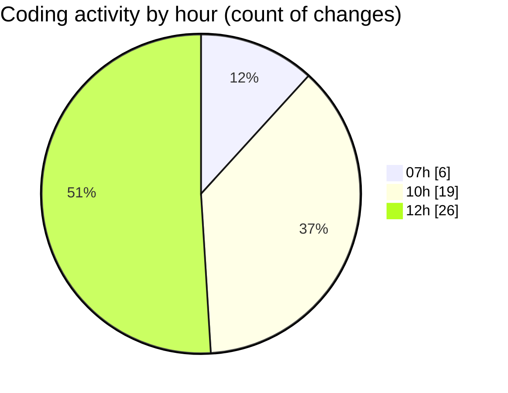

# rentOTP - Activity Summary 

## Overall Statistics

| Stat                   | Value                                                             |
| ---------------------- | ----------------------------------------------------------------- |
| **Lines Added** (➕)   | 5477                                          |
| **Lines Removed** (➖) | 2231                                        |
| **Net Change** (↕)    | 3246                |
| **Active Time** (⌚)   | 52 minutes |

## Modified Files
- **MailServices.vue** (+837, -212)
- **ServiceModal.vue** (+1766, -882)
- **MailManagement.vue** (+1746, -1117)
- **main.js** (+219, -5)
- **AdminSidebar.vue** (+393, -0)
- **MailModal.vue** (+516, -15)

## Visualizations

### By File Type (Lines Changed)

### By Hour (Estimated Activity Count)

> **Last Updated:** 8/14/2025, 12:51:37 PM