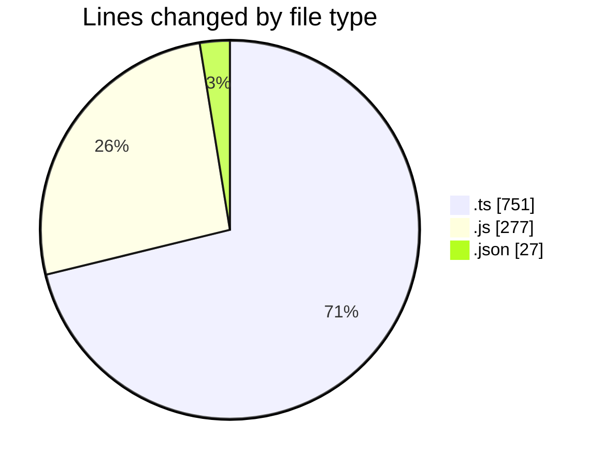
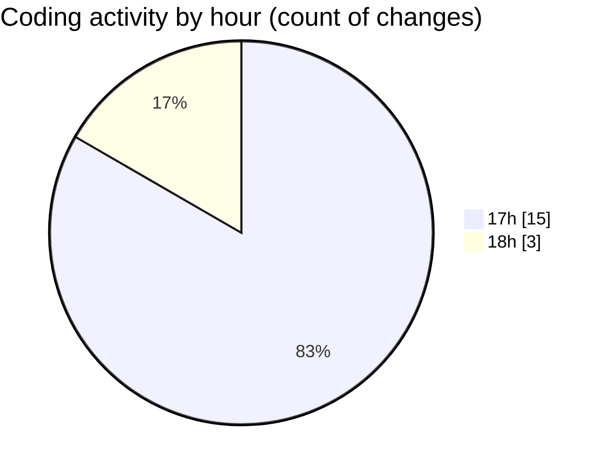

# rentOTP - Activity Summary 

## Overall Statistics

| Stat                   | Value                                                             |
| ---------------------- | ----------------------------------------------------------------- |
| **Lines Added** (➕)   | 985                                          |
| **Lines Removed** (➖) | 70                                        |
| **Net Change** (↕)    | 915                |
| **Active Time** (⌚)   | 16 minutes |

## Modified Files
- **mail-result.schema.ts** (+66, -24)
- **mail-result.dto.ts** (+44, -30)
- **otp.module.ts** (+21, -0)
- **otp.service.ts** (+481, -16)
- **otp.controller.ts** (+69, -0)
- **cron-tool-example.js** (+277, -0)
- **package.json** (+27, -0)

## Visualizations

### By File Type (Lines Changed)

### By Hour (Estimated Activity Count)

> **Last Updated:** 8/15/2025, 6:03:14 PM