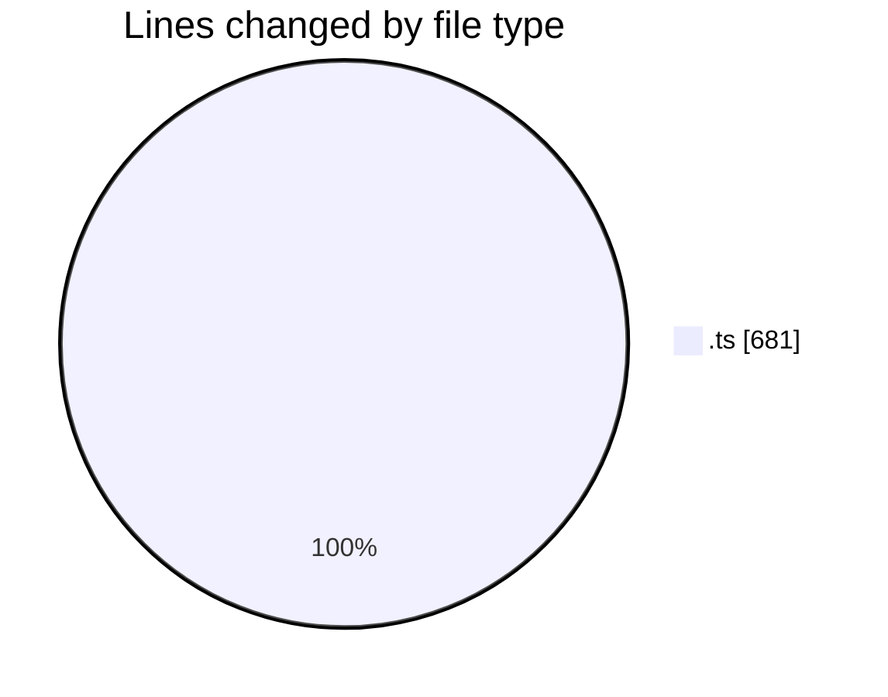
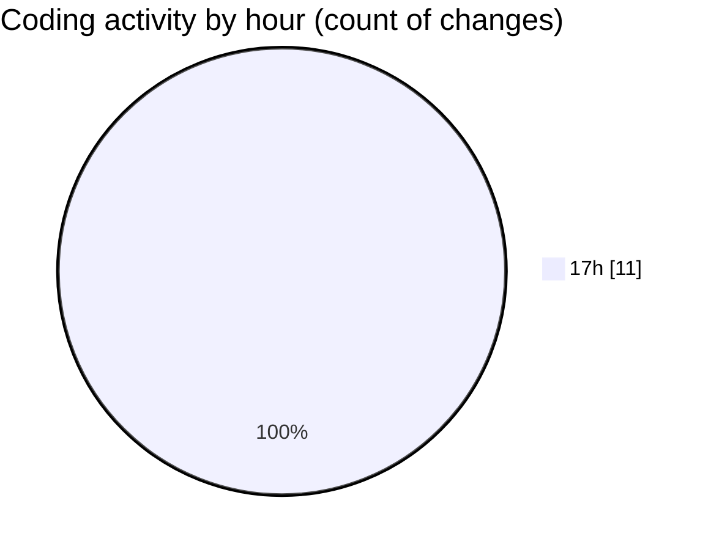

# rentOTP - Activity Summary 

## Overall Statistics

| Stat                   | Value                                                             |
| ---------------------- | ----------------------------------------------------------------- |
| **Lines Added** (➕)   | 681                                          |
| **Lines Removed** (➖) | 0                                        |
| **Net Change** (↕)    | 681                |
| **Active Time** (⌚)   | 10 minutes |

## Modified Files
- **mail-result.schema.ts** (+66, -0)
- **mail-result.dto.ts** (+44, -0)
- **otp.module.ts** (+21, -0)
- **otp.service.ts** (+481, -0)
- **otp.controller.ts** (+69, -0)

## Visualizations

### By File Type (Lines Changed)

### By Hour (Estimated Activity Count)

> **Last Updated:** 8/15/2025, 5:53:14 PM