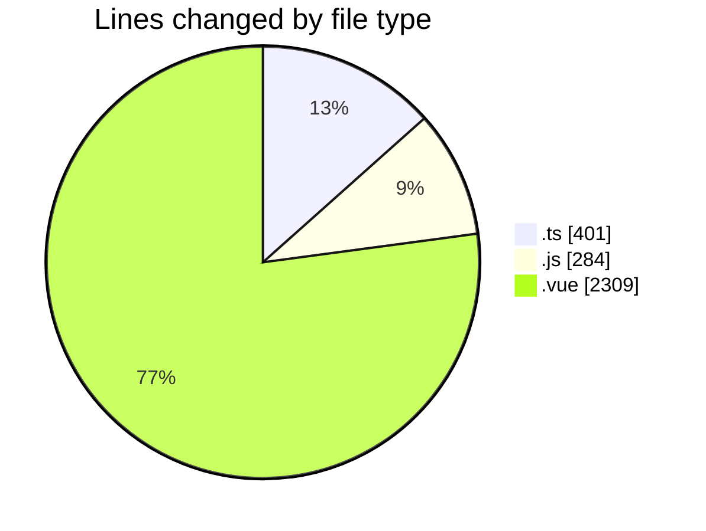

# rentOTP - Activity Summary 

## Overall Statistics

| Stat                   | Value                                                             |
| ---------------------- | ----------------------------------------------------------------- |
| **Lines Added** (➕)   | 2851                                          |
| **Lines Removed** (➖) | 143                                        |
| **Net Change** (↕)    | 2708                |
| **Active Time** (⌚)   | 61 minutes |

## Modified Files
- **admin.service.ts** (+122, -96)
- **admin.controller.ts** (+62, -3)
- **apiService.js** (+63, -3)
- **admin.module.ts** (+29, -2)
- **AdminSidebar.vue** (+394, -0)
- **main.js** (+217, -1)
- **Dashboard.vue** (+617, -31)
- **EmailSMTP.vue** (+624, -0)
- **Services.vue** (+643, -0)
- **email.schema.ts** (+52, -0)
- **service.schema.ts** (+0, -7)
- **otp.service.ts** (+26, -0)
- **otp.module.ts** (+2, -0)

## Visualizations

### By File Type (Lines Changed)

### By Hour (Estimated Activity Count)

> **Last Updated:** 8/16/2025, 12:36:25 AM