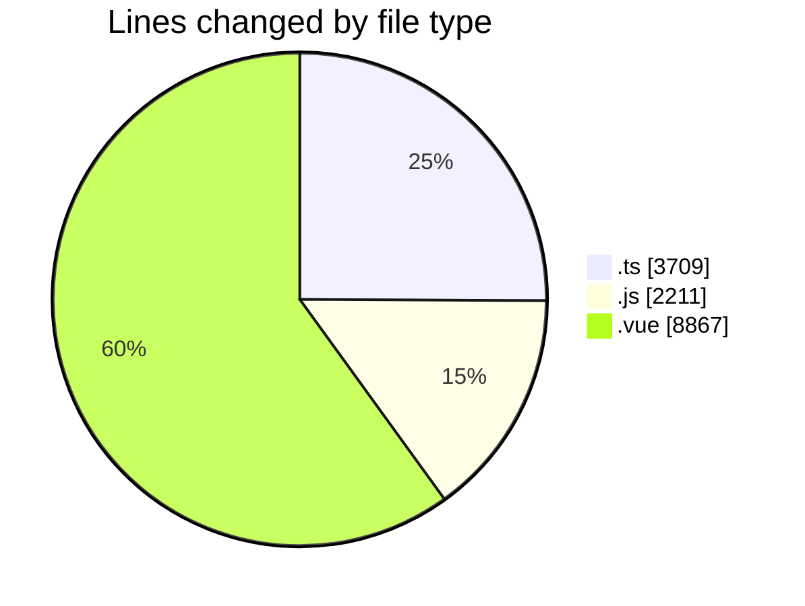
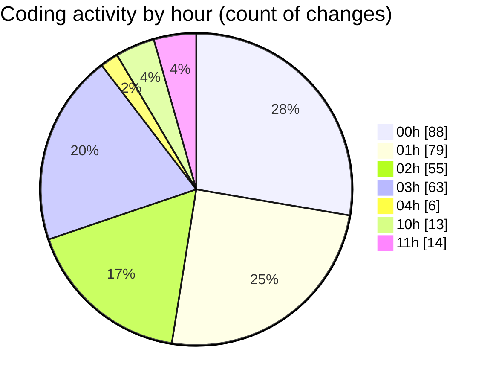

# rentOTP - Activity Summary 

## Overall Statistics

| Stat                   | Value                                                             |
| ---------------------- | ----------------------------------------------------------------- |
| **Lines Added** (➕)   | 12326                                          |
| **Lines Removed** (➖) | 2461                                        |
| **Net Change** (↕)    | 9865                |
| **Active Time** (⌚)   | 398 minutes |

## Modified Files
- **admin.service.ts** (+677, -248)
- **admin.controller.ts** (+358, -24)
- **apiService.js** (+138, -24)
- **admin.module.ts** (+31, -2)
- **AdminSidebar.vue** (+394, -0)
- **main.js** (+223, -1)
- **Dashboard.vue** (+617, -31)
- **EmailSMTP.vue** (+2454, -1381)
- **Services.vue** (+1090, -28)
- **email.schema.ts** (+62, -0)
- **service.schema.ts** (+0, -7)
- **otp.service.ts** (+1338, -158)
- **otp.module.ts** (+7, -2)
- **mail.schema.ts** (+105, -5)
- **Notification.vue** (+383, -191)
- **App.vue** (+30, -12)
- **notification.js** (+103, -48)
- **check-mail-db.js** (+132, -0)
- **test-api.js** (+41, -0)
- **service.seed.ts** (+93, -0)
- **otp-order.schema.ts** (+57, -3)
- **otp.controller.ts** (+103, -12)
- **api.js** (+92, -0)
- **order-status.cron.ts** (+49, -0)
- **app.module.ts** (+31, -0)
- **RentOTP.vue** (+847, -169)
- **rent-otp.dto.ts** (+15, -0)
- **client.service.ts** (+209, -0)
- **mail-result.dto.ts** (+1, -0)
- **cron.controller.ts** (+20, -0)
- **test-cron-api.js** (+37, -0)
- **test-simple.js** (+41, -0)
- **History.vue** (+757, -65)
- **OrderDetails.vue** (+417, -1)
- **test-cron-flow.js** (+90, -0)
- **user.seed.ts** (+92, -0)
- **cron-tool-updated.js** (+283, -0)
- **seed-email-data.js** (+149, -0)
- **test-email-system.js** (+161, -0)
- **test-continuous-email.js** (+239, -0)
- **index.js** (+360, -49)

## Visualizations

### By File Type (Lines Changed)

### By Hour (Estimated Activity Count)

> **Last Updated:** 8/16/2025, 11:10:48 AM