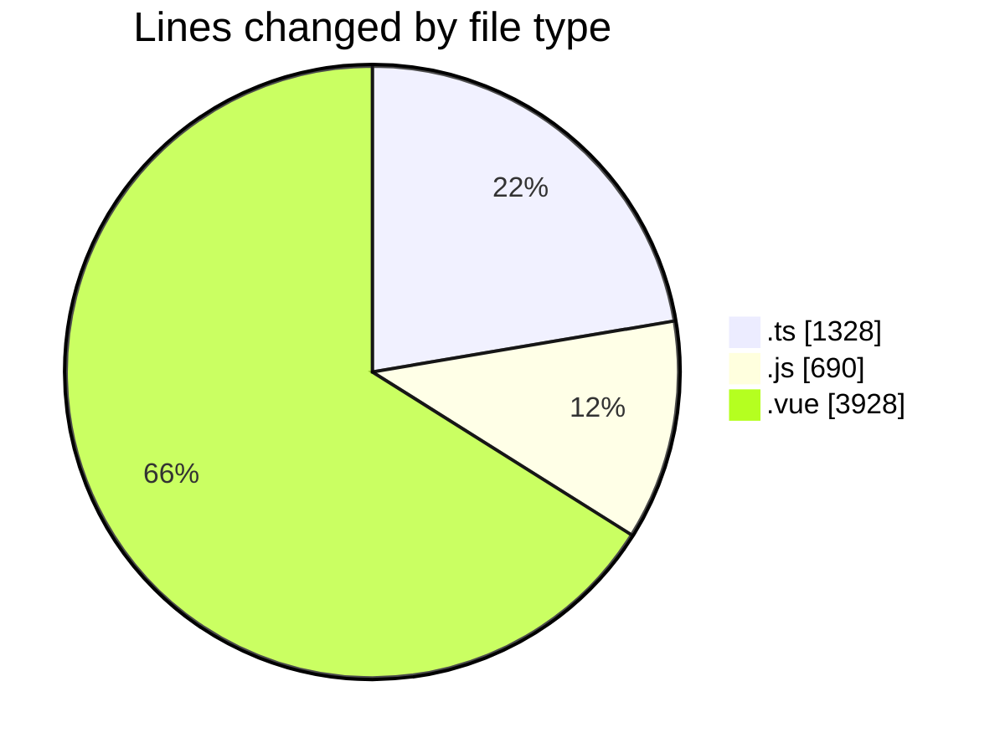
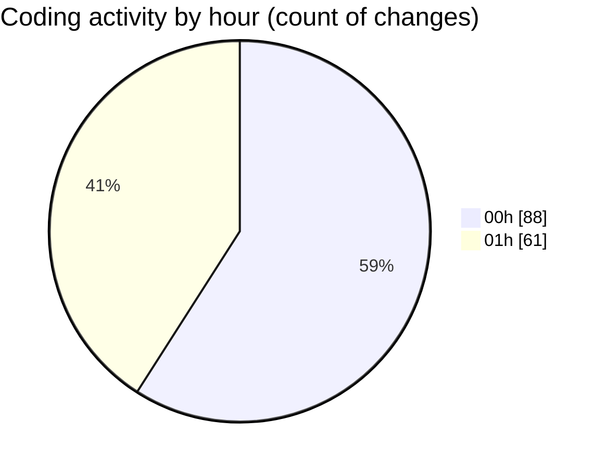

# rentOTP - Activity Summary 

## Overall Statistics

| Stat                   | Value                                                             |
| ---------------------- | ----------------------------------------------------------------- |
| **Lines Added** (➕)   | 5050                                          |
| **Lines Removed** (➖) | 896                                        |
| **Net Change** (↕)    | 4154                |
| **Active Time** (⌚)   | 177 minutes |

## Modified Files
- **admin.service.ts** (+677, -248)
- **admin.controller.ts** (+124, -24)
- **apiService.js** (+124, -24)
- **admin.module.ts** (+31, -2)
- **AdminSidebar.vue** (+394, -0)
- **main.js** (+217, -1)
- **Dashboard.vue** (+617, -31)
- **EmailSMTP.vue** (+1329, -298)
- **Services.vue** (+643, -0)
- **email.schema.ts** (+62, -0)
- **service.schema.ts** (+0, -7)
- **otp.service.ts** (+32, -3)
- **otp.module.ts** (+6, -2)
- **mail.schema.ts** (+105, -5)
- **Notification.vue** (+383, -191)
- **App.vue** (+30, -12)
- **notification.js** (+103, -48)
- **check-mail-db.js** (+132, -0)
- **test-api.js** (+41, -0)

## Visualizations

### By File Type (Lines Changed)

### By Hour (Estimated Activity Count)

> **Last Updated:** 8/16/2025, 1:51:25 AM