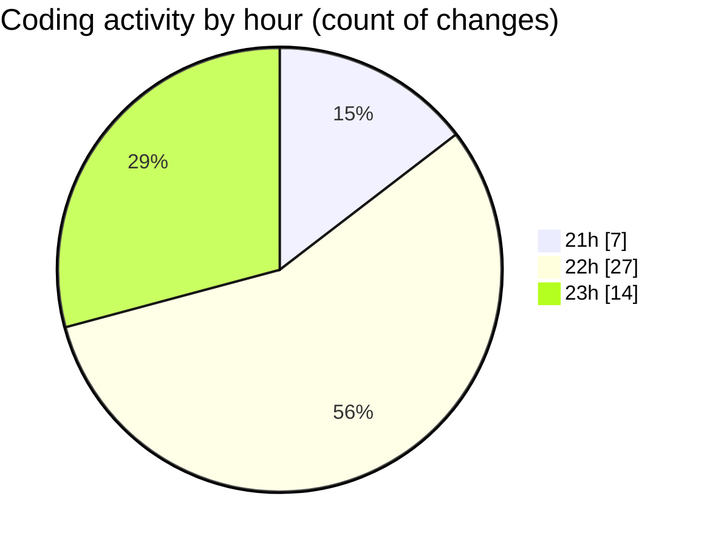

# studyBuddy - Activity Summary 

## Overall Statistics

| Stat                   | Value                                                             |
| ---------------------- | ----------------------------------------------------------------- |
| **Lines Added** (➕)   | 6024                                          |
| **Lines Removed** (➖) | 497                                        |
| **Net Change** (↕)    | 5527                |
| **Active Time** (⌚)   | 50 minutes |

## Modified Files
- **notification_service.dart** (+780, -0)
- **settings_screen.dart** (+173, -0)
- **dashboard_screen.dart** (+791, -0)
- **main.dart** (+148, -23)
- **subject_local_storage.dart** (+134, -0)
- **subject_repository.dart** (+271, -0)
- **subject_provider.dart** (+185, -0)
- **app_theme.dart** (+1297, -447)
- **gradient_card.dart** (+221, -0)
- **calendar_screen.dart** (+716, -2)
- **task_local_storage.dart** (+140, -0)
- **event_local_storage.dart** (+140, -0)
- **study_target_local_storage.dart** (+144, -0)
- **task_repository.dart** (+510, -25)
- **task_provider.dart** (+374, -0)

## Visualizations

### By File Type (Lines Changed)

### By Hour (Estimated Activity Count)

> **Last Updated:** 8/16/2025, 11:23:45 PM