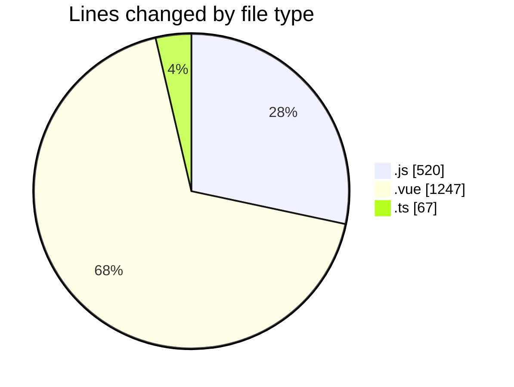
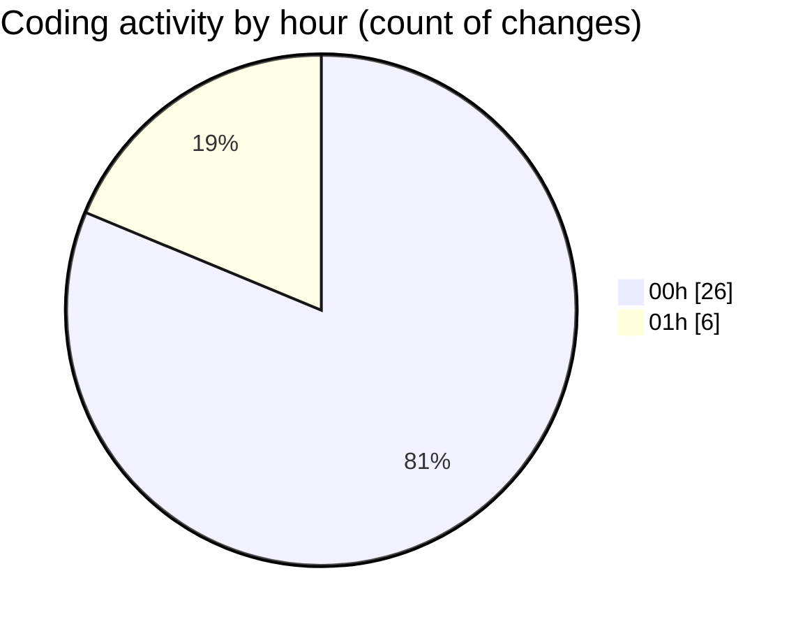

# rentOTP - Activity Summary 

## Overall Statistics

| Stat                   | Value                                                             |
| ---------------------- | ----------------------------------------------------------------- |
| **Lines Added** (➕)   | 1815                                          |
| **Lines Removed** (➖) | 19                                        |
| **Net Change** (↕)    | 1796                |
| **Active Time** (⌚)   | 33 minutes |

## Modified Files
- **check-db.js** (+43, -0)
- **OrderHistory.vue** (+696, -8)
- **test-frontend-order-history.js** (+61, -0)
- **test-frontend-browser.js** (+58, -0)
- **authService.js** (+84, -0)
- **api.js** (+91, -0)
- **Login.vue** (+193, -6)
- **auth.guard.js** (+99, -5)
- **auth.controller.ts** (+67, -0)
- **Register.vue** (+266, -0)
- **SessionExpiredModal.vue** (+51, -0)
- **eventBus.js** (+17, -0)
- **App.vue** (+27, -0)
- **test-session-system.js** (+62, -0)

## Visualizations

### By File Type (Lines Changed)

### By Hour (Estimated Activity Count)

> **Last Updated:** 8/17/2025, 1:03:25 AM