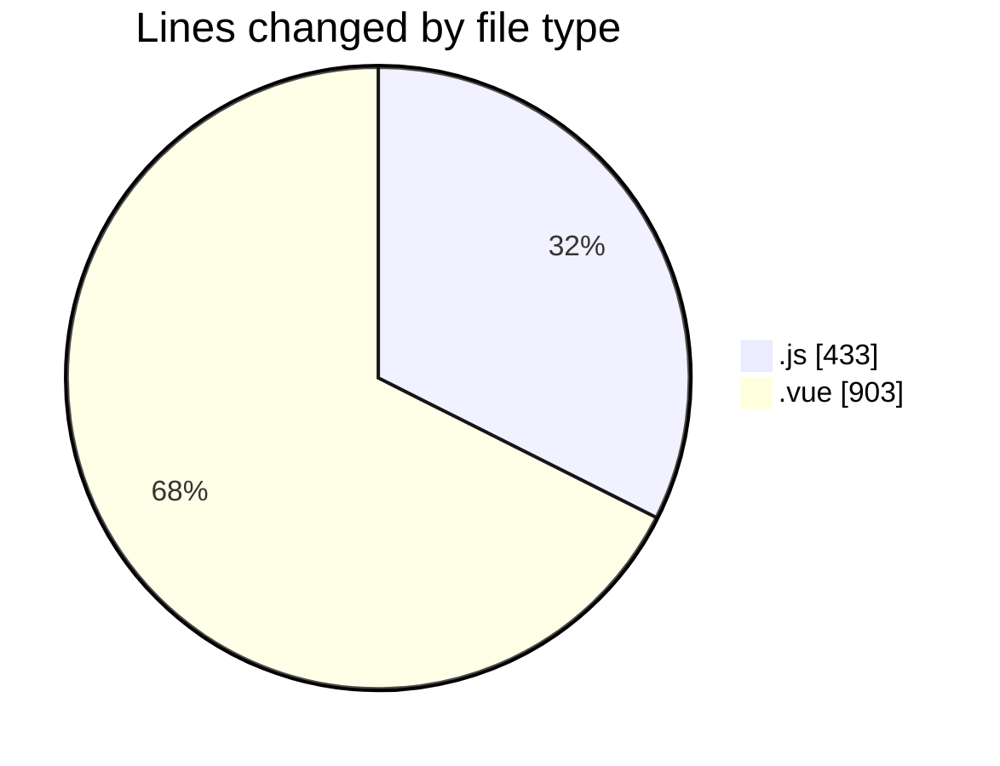
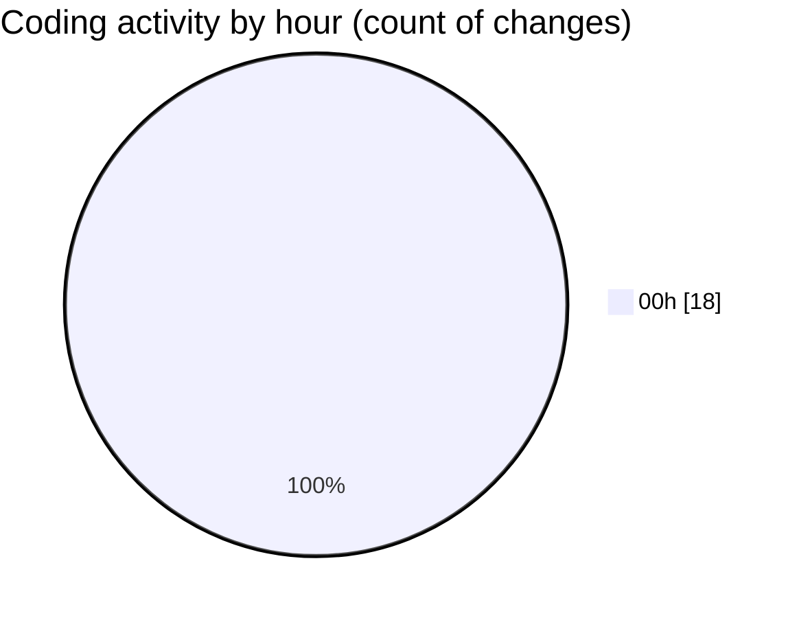

# rentOTP - Activity Summary 

## Overall Statistics

| Stat                   | Value                                                             |
| ---------------------- | ----------------------------------------------------------------- |
| **Lines Added** (➕)   | 1320                                          |
| **Lines Removed** (➖) | 16                                        |
| **Net Change** (↕)    | 1304                |
| **Active Time** (⌚)   | 19 minutes |

## Modified Files
- **check-db.js** (+43, -0)
- **OrderHistory.vue** (+696, -8)
- **test-frontend-order-history.js** (+61, -0)
- **test-frontend-browser.js** (+58, -0)
- **authService.js** (+80, -0)
- **api.js** (+90, -0)
- **Login.vue** (+193, -6)
- **auth.guard.js** (+99, -2)

## Visualizations

### By File Type (Lines Changed)

### By Hour (Estimated Activity Count)

> **Last Updated:** 8/17/2025, 12:58:25 AM