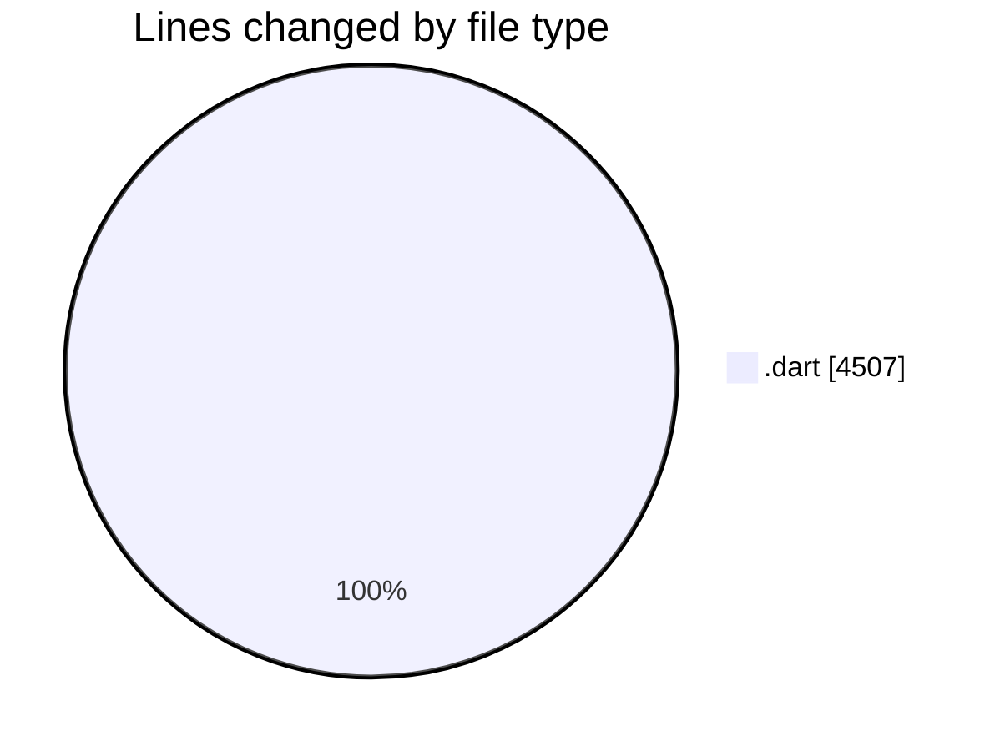
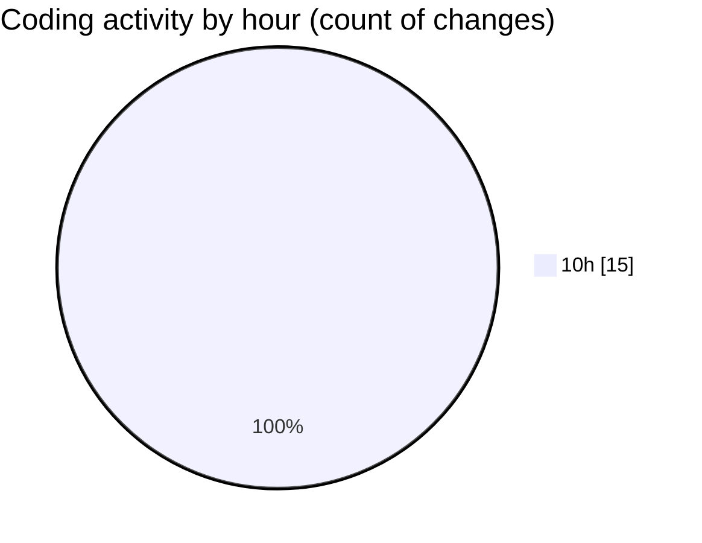

# studyBuddy - Activity Summary 

## Overall Statistics

| Stat                   | Value                                                             |
| ---------------------- | ----------------------------------------------------------------- |
| **Lines Added** (➕)   | 4204                                          |
| **Lines Removed** (➖) | 303                                        |
| **Net Change** (↕)    | 3901                |
| **Active Time** (⌚)   | 22 minutes |

## Modified Files
- **error_display_widget.dart** (+57, -0)
- **task_search_dialog.dart** (+329, -0)
- **subject_repository.dart** (+271, -0)
- **register_screen.dart** (+279, -0)
- **task_form_dialog.dart** (+391, -0)
- **subject_form_dialog.dart** (+232, -0)
- **study_target_form_dialog.dart** (+359, -0)
- **event_form_dialog.dart** (+547, -0)
- **add_task_screen.dart** (+607, -303)
- **login_screen.dart** (+327, -0)
- **task_list.dart** (+72, -0)
- **task_card.dart** (+532, -0)
- **empty_state.dart** (+201, -0)

## Visualizations

### By File Type (Lines Changed)

### By Hour (Estimated Activity Count)

> **Last Updated:** 8/17/2025, 10:52:51 AM