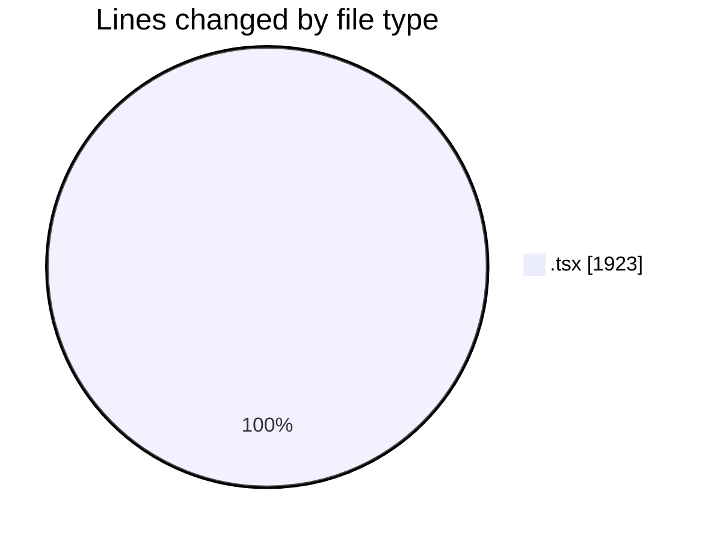
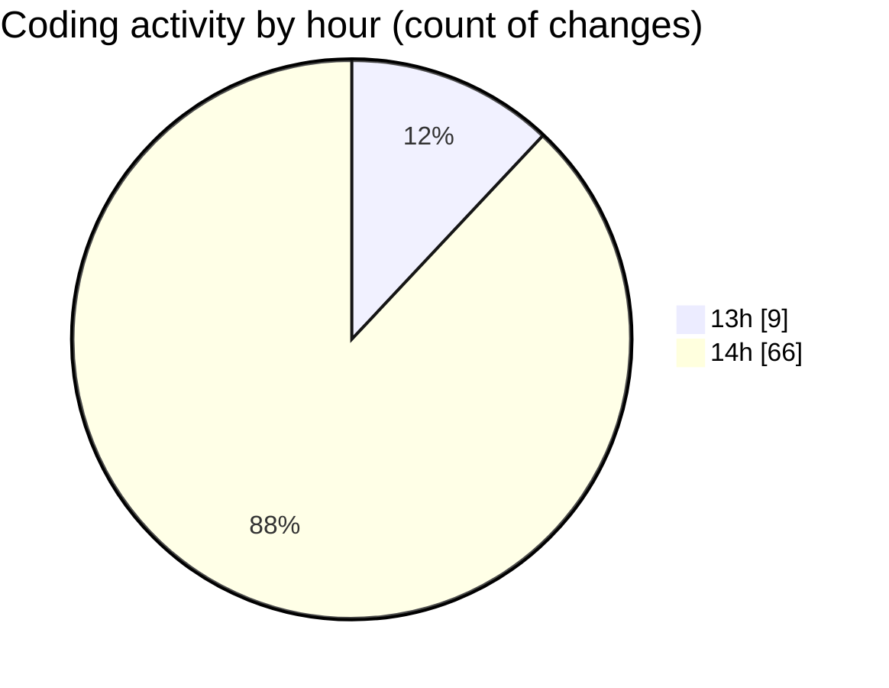

# nextui-dashboard-template - Activity Summary 

## Overall Statistics

| Stat                   | Value                                                             |
| ---------------------- | ----------------------------------------------------------------- |
| **Lines Added** (➕)   | 1798                                          |
| **Lines Removed** (➖) | 125                                        |
| **Net Change** (↕)    | 1673                |
| **Active Time** (⌚)   | 81 minutes |

## Modified Files
- **sidebar.tsx** (+191, -42)
- **collapse-items.tsx** (+140, -83)
- **submenu-items.tsx** (+63, -0)
- **page.tsx** (+78, -0)
- **page.tsx** (+116, -0)
- **page.tsx** (+185, -0)
- **page.tsx** (+186, -0)
- **page.tsx** (+65, -0)
- **page.tsx** (+52, -0)
- **page.tsx** (+63, -0)
- **page.tsx** (+33, -0)
- **page.tsx** (+36, -0)
- **page.tsx** (+75, -0)
- **page.tsx** (+33, -0)
- **page.tsx** (+33, -0)
- **page.tsx** (+29, -0)
- **page.tsx** (+30, -0)
- **page.tsx** (+74, -0)
- **page.tsx** (+28, -0)
- **page.tsx** (+29, -0)
- **page.tsx** (+28, -0)
- **page.tsx** (+33, -0)
- **page.tsx** (+28, -0)
- **page.tsx** (+28, -0)
- **page.tsx** (+28, -0)
- **page.tsx** (+56, -0)
- **page.tsx** (+58, -0)

## Visualizations

### By File Type (Lines Changed)

### By Hour (Estimated Activity Count)

> **Last Updated:** 8/18/2025, 3:01:15 PM