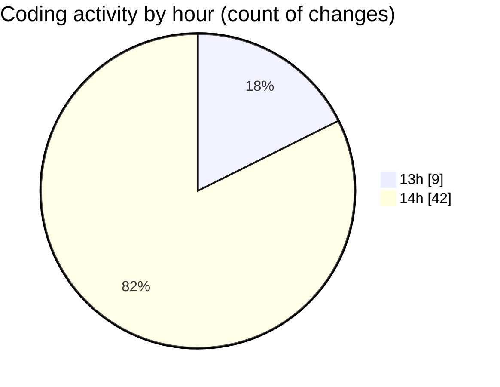

# nextui-dashboard-template - Activity Summary 

## Overall Statistics

| Stat                   | Value                                                             |
| ---------------------- | ----------------------------------------------------------------- |
| **Lines Added** (➕)   | 1750                                          |
| **Lines Removed** (➖) | 125                                        |
| **Net Change** (↕)    | 1625                |
| **Active Time** (⌚)   | 58 minutes |

## Modified Files
- **sidebar.tsx** (+191, -42)
- **collapse-items.tsx** (+140, -83)
- **submenu-items.tsx** (+63, -0)
- **page.tsx** (+76, -0)
- **page.tsx** (+114, -0)
- **page.tsx** (+183, -0)
- **page.tsx** (+184, -0)
- **page.tsx** (+63, -0)
- **page.tsx** (+50, -0)
- **page.tsx** (+61, -0)
- **page.tsx** (+31, -0)
- **page.tsx** (+34, -0)
- **page.tsx** (+73, -0)
- **page.tsx** (+31, -0)
- **page.tsx** (+31, -0)
- **page.tsx** (+27, -0)
- **page.tsx** (+28, -0)
- **page.tsx** (+72, -0)
- **page.tsx** (+26, -0)
- **page.tsx** (+27, -0)
- **page.tsx** (+26, -0)
- **page.tsx** (+31, -0)
- **page.tsx** (+26, -0)
- **page.tsx** (+26, -0)
- **page.tsx** (+26, -0)
- **page.tsx** (+54, -0)
- **page.tsx** (+56, -0)

## Visualizations

### By File Type (Lines Changed)

### By Hour (Estimated Activity Count)

> **Last Updated:** 8/18/2025, 2:51:15 PM