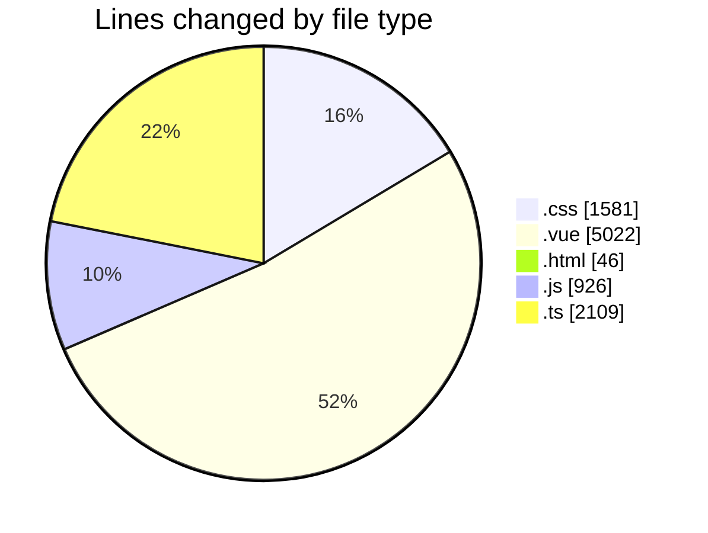
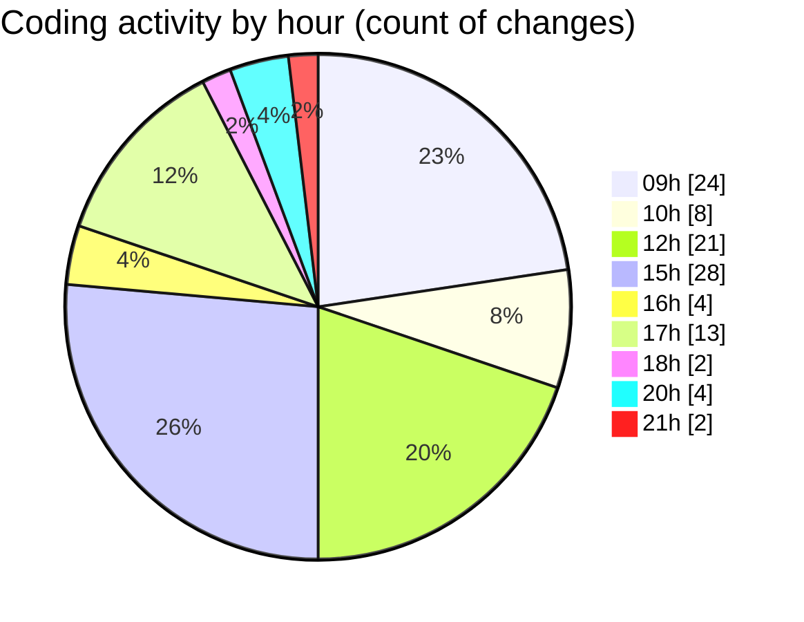

# rentOTP - Activity Summary 

## Overall Statistics

| Stat                   | Value                                                             |
| ---------------------- | ----------------------------------------------------------------- |
| **Lines Added** (➕)   | 9615                                          |
| **Lines Removed** (➖) | 69                                        |
| **Net Change** (↕)    | 9546                |
| **Active Time** (⌚)   | 109 minutes |

## Modified Files
- **mobile-responsive.css** (+338, -0)
- **index.css** (+420, -0)
- **Client.vue** (+267, -37)
- **ClientSidebar.vue** (+356, -0)
- **Dashboard.vue** (+526, -0)
- **RentOTP.vue** (+682, -0)
- **OrderHistory.vue** (+561, -0)
- **mobile-fixes.css** (+389, -0)
- **index.html** (+46, -0)
- **MobileMenu.vue** (+319, -0)
- **mobile-optimizations.css** (+434, -0)
- **MobileTable.vue** (+131, -0)
- **OTPResultCard.vue** (+202, -0)
- **sidebarStore.js** (+123, -0)
- **settings.schema.ts** (+79, -0)
- **admin.service.ts** (+1246, -0)
- **deposit.schema.ts** (+66, -0)
- **create-deposit.dto.ts** (+31, -0)
- **deposit.service.ts** (+251, -3)
- **deposit.controller.ts** (+58, -0)
- **api.js** (+93, -0)
- **apiService.js** (+453, -0)
- **main.js** (+257, -0)
- **deposit.module.ts** (+21, -0)
- **Deposit.vue** (+978, -29)
- **DepositOrder.vue** (+180, -0)
- **bank.schema.ts** (+32, -0)
- **admin.controller.ts** (+255, -0)
- **database.module.ts** (+36, -0)
- **Banks.vue** (+310, -0)
- **admin.module.ts** (+31, -0)
- **AdminSidebar.vue** (+444, -0)

## Visualizations

### By File Type (Lines Changed)

### By Hour (Estimated Activity Count)

> **Last Updated:** 8/18/2025, 9:28:14 PM