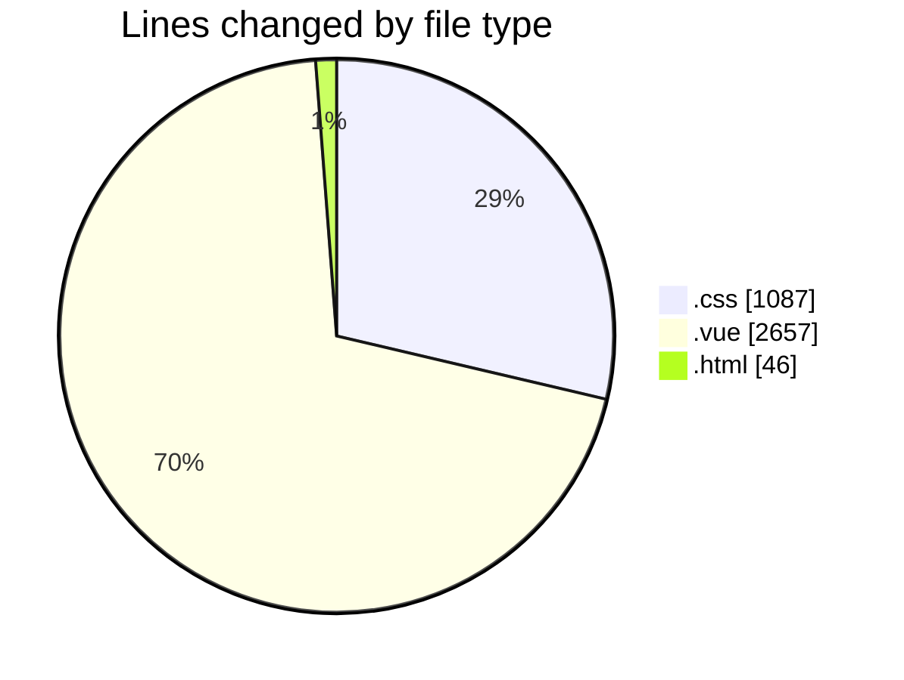
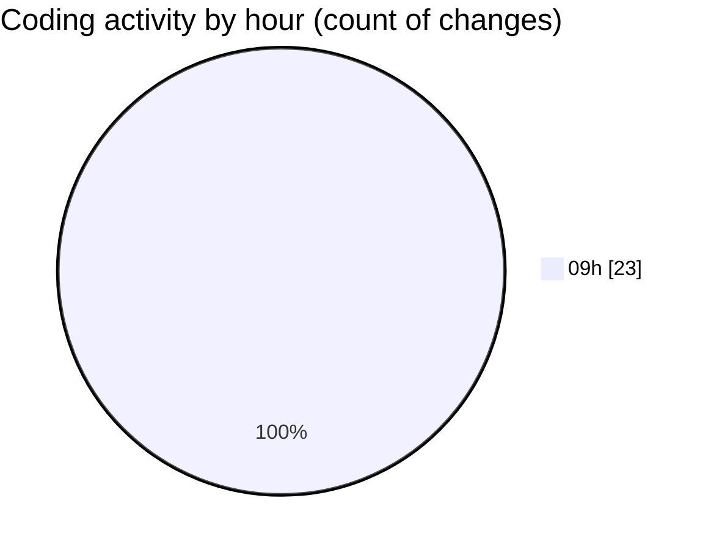

# rentOTP - Activity Summary 

## Overall Statistics

| Stat                   | Value                                                             |
| ---------------------- | ----------------------------------------------------------------- |
| **Lines Added** (➕)   | 3790                                          |
| **Lines Removed** (➖) | 0                                        |
| **Net Change** (↕)    | 3790                |
| **Active Time** (⌚)   | 22 minutes |

## Modified Files
- **mobile-responsive.css** (+333, -0)
- **index.css** (+419, -0)
- **Client.vue** (+258, -0)
- **ClientSidebar.vue** (+336, -0)
- **Dashboard.vue** (+526, -0)
- **RentOTP.vue** (+682, -0)
- **OrderHistory.vue** (+561, -0)
- **mobile-fixes.css** (+335, -0)
- **index.html** (+46, -0)
- **MobileMenu.vue** (+294, -0)

## Visualizations

### By File Type (Lines Changed)

### By Hour (Estimated Activity Count)

> **Last Updated:** 8/18/2025, 9:58:13 AM