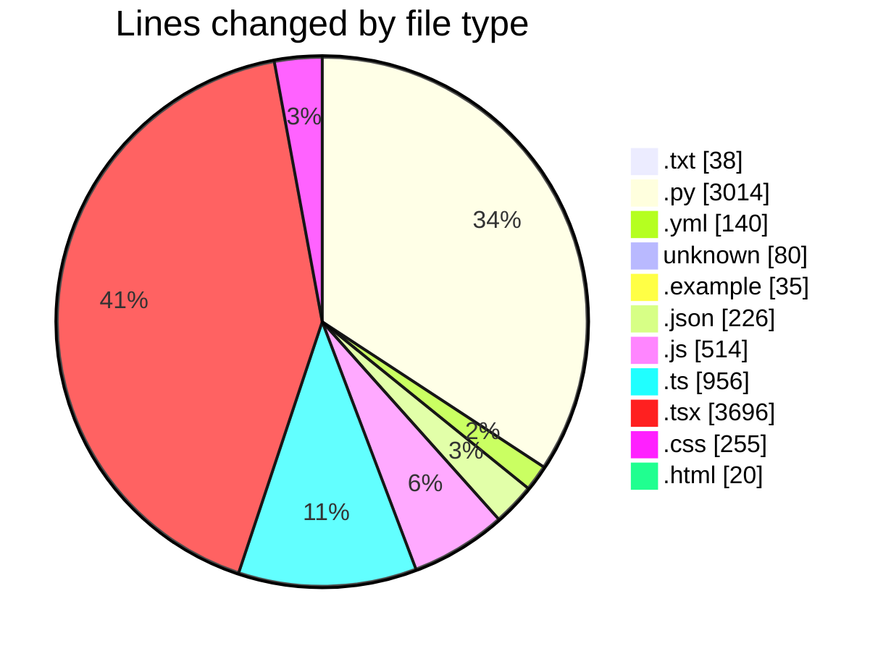
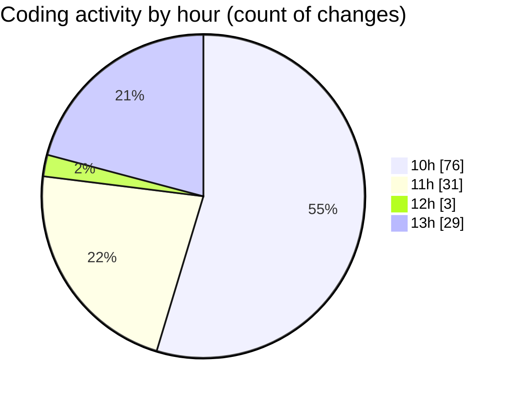

# VPS-V1 - Activity Summary 

## Overall Statistics

| Stat                   | Value                                                             |
| ---------------------- | ----------------------------------------------------------------- |
| **Lines Added** (➕)   | 8853                                          |
| **Lines Removed** (➖) | 121                                        |
| **Net Change** (↕)    | 8732                |
| **Active Time** (⌚)   | 144 minutes |

## Modified Files
- **requirements.txt** (+38, -0)
- **main.py** (+71, -0)
- **config.py** (+99, -0)
- **database.py** (+41, -0)
- **user.py** (+100, -0)
- **server.py** (+113, -0)
- **client.py** (+191, -0)
- **docker-compose.yml** (+140, -0)
- **Dockerfile** (+38, -0)
- **env.example** (+35, -0)
- **logging.py** (+40, -0)
- **vps.py** (+136, -0)
- **hosting.py** (+172, -0)
- **billing.py** (+201, -0)
- **api.py** (+13, -0)
- **auth.py** (+169, -0)
- **security.py** (+41, -0)
- **deps.py** (+50, -0)
- **servers.py** (+266, -0)
- **users.py** (+182, -0)
- **vps.py** (+282, -0)
- **hosting.py** (+368, -0)
- **billing.py** (+363, -0)
- **init_db.py** (+116, -0)
- **package.json** (+132, -23)
- **tailwind.config.js** (+99, -0)
- **index.ts** (+395, -0)
- **index.ts** (+177, -0)
- **api.ts** (+289, -0)
- **Button.tsx** (+96, -0)
- **Input.tsx** (+81, -0)
- **Card.tsx** (+84, -0)
- **Modal.tsx** (+109, -0)
- **Table.tsx** (+158, -0)
- **Badge.tsx** (+48, -0)
- **Select.tsx** (+191, -0)
- **index.ts** (+7, -0)
- **Sidebar.tsx** (+212, -0)
- **Header.tsx** (+153, -0)
- **Layout.tsx** (+36, -0)
- **index.ts** (+3, -0)
- **LoginPage.tsx** (+183, -0)
- **DashboardPage.tsx** (+284, -0)
- **App.tsx** (+218, -97)
- **index.tsx** (+14, -0)
- **index.css** (+91, -0)
- **auth.ts** (+37, -0)
- **index.ts** (+48, -0)
- **index.html** (+20, -0)
- **manifest.json** (+25, -0)
- **VPSListPage.tsx** (+475, -0)
- **HostingListPage.tsx** (+547, -0)
- **BillingPage.tsx** (+614, -0)
- **.cursorrules** (+5, -0)
- **.env** (+36, -1)
- **package.json** (+46, -0)
- **app.js** (+85, -0)
- **database.js** (+17, -0)
- **User.js** (+108, -0)
- **auth.js** (+161, -0)
- **auth.js** (+22, -0)
- **next.config.js** (+22, -0)
- **layout.tsx** (+42, -0)
- **providers.tsx** (+27, -0)
- **page.tsx** (+27, -0)
- **globals.css** (+164, -0)

## Visualizations

### By File Type (Lines Changed)

### By Hour (Estimated Activity Count)

> **Last Updated:** 8/18/2025, 1:51:14 PM