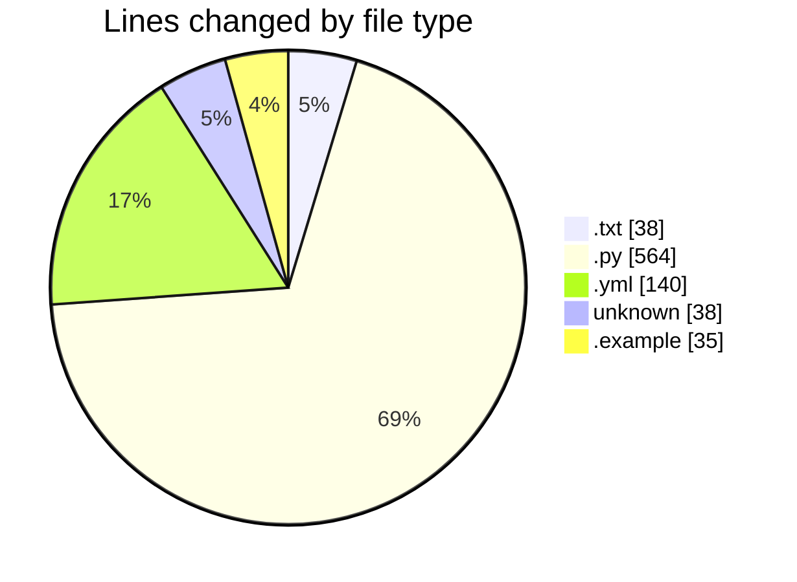

# VPS-V1 - Activity Summary 

## Overall Statistics

| Stat                   | Value                                                             |
| ---------------------- | ----------------------------------------------------------------- |
| **Lines Added** (➕)   | 815                                          |
| **Lines Removed** (➖) | 0                                        |
| **Net Change** (↕)    | 815                |
| **Active Time** (⌚)   | 19 minutes |

## Modified Files
- **requirements.txt** (+38, -0)
- **main.py** (+71, -0)
- **config.py** (+48, -0)
- **database.py** (+41, -0)
- **user.py** (+100, -0)
- **server.py** (+113, -0)
- **client.py** (+191, -0)
- **docker-compose.yml** (+140, -0)
- **Dockerfile** (+38, -0)
- **env.example** (+35, -0)

## Visualizations

### By File Type (Lines Changed)

### By Hour (Estimated Activity Count)

> **Last Updated:** 8/18/2025, 10:27:18 AM