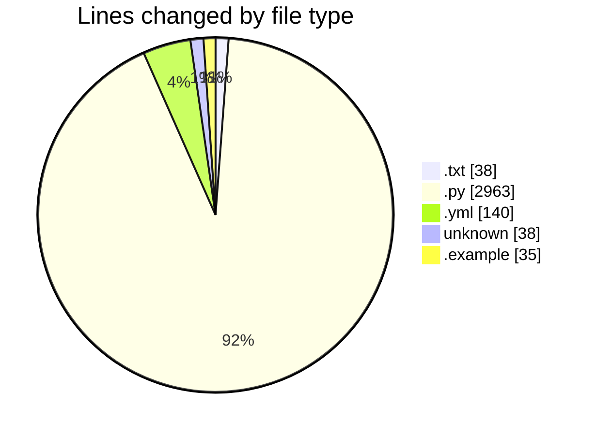

# VPS-V1 - Activity Summary 

## Overall Statistics

| Stat                   | Value                                                             |
| ---------------------- | ----------------------------------------------------------------- |
| **Lines Added** (➕)   | 3214                                          |
| **Lines Removed** (➖) | 0                                        |
| **Net Change** (↕)    | 3214                |
| **Active Time** (⌚)   | 47 minutes |

## Modified Files
- **requirements.txt** (+38, -0)
- **main.py** (+71, -0)
- **config.py** (+48, -0)
- **database.py** (+41, -0)
- **user.py** (+100, -0)
- **server.py** (+113, -0)
- **client.py** (+191, -0)
- **docker-compose.yml** (+140, -0)
- **Dockerfile** (+38, -0)
- **env.example** (+35, -0)
- **logging.py** (+40, -0)
- **vps.py** (+136, -0)
- **hosting.py** (+172, -0)
- **billing.py** (+201, -0)
- **api.py** (+13, -0)
- **auth.py** (+169, -0)
- **security.py** (+41, -0)
- **deps.py** (+50, -0)
- **servers.py** (+266, -0)
- **users.py** (+182, -0)
- **vps.py** (+282, -0)
- **hosting.py** (+368, -0)
- **billing.py** (+363, -0)
- **init_db.py** (+116, -0)

## Visualizations

### By File Type (Lines Changed)

### By Hour (Estimated Activity Count)

> **Last Updated:** 8/18/2025, 10:37:18 AM