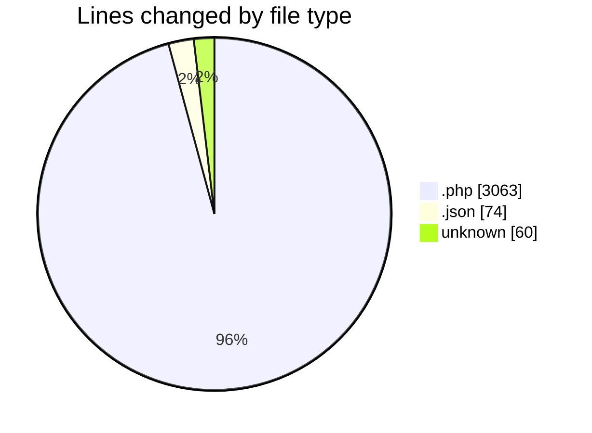
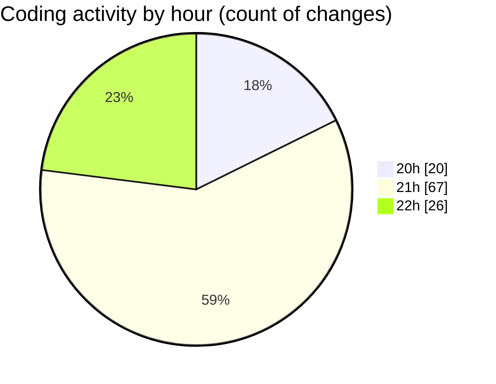

# quytuthien.vn - Activity Summary 

## Overall Statistics

| Stat                   | Value                                                             |
| ---------------------- | ----------------------------------------------------------------- |
| **Lines Added** (➕)   | 3191                                          |
| **Lines Removed** (➖) | 6                                        |
| **Net Change** (↕)    | 3185                |
| **Active Time** (⌚)   | 124 minutes |

## Modified Files
- **app.php** (+189, -0)
- **composer.json** (+74, -0)
- **2025_08_19_100000_create_profiles_table.php** (+36, -0)
- **2025_08_19_100100_create_categories_and_locations_tables.php** (+34, -0)
- **2025_08_19_100200_create_campaigns_tables.php** (+49, -0)
- **2025_08_19_100300_create_donations_and_receipts_tables.php** (+49, -0)
- **2025_08_19_100400_create_expenses_table.php** (+34, -0)
- **2025_08_19_100500_create_bank_and_reconciliation_tables.php** (+46, -0)
- **Campaign.php** (+64, -0)
- **Category.php** (+22, -0)
- **CampaignUpdate.php** (+33, -0)
- **Donation.php** (+49, -0)
- **Expense.php** (+38, -0)
- **Profile.php** (+29, -0)
- **Receipt.php** (+32, -0)
- **BankStatement.php** (+36, -0)
- **Reconciliation.php** (+38, -0)
- **Location.php** (+19, -0)
- **User.php** (+64, -0)
- **web.php** (+41, -6)
- **CampaignController.php** (+42, -0)
- **api.php** (+57, -0)
- **DatabaseSeeder.php** (+25, -0)
- **payment.php** (+21, -0)
- **VnpayService.php** (+23, -0)
- **MomoService.php** (+21, -0)
- **DonateController.php** (+86, -0)
- **TransparencyController.php** (+37, -0)
- **MapController.php** (+23, -0)
- **BankImportController.php** (+47, -0)
- **ReconcileController.php** (+76, -0)
- **ReceiptService.php** (+50, -0)
- **ReceiptController.php** (+30, -0)
- **receipt.blade.php** (+33, -0)
- **LookupSeeder.php** (+36, -0)
- **2025_08_19_100050_add_permission_tables.php** (+64, -0)
- **PermissionSeeder.php** (+42, -0)
- **CampaignAdminController.php** (+50, -0)
- **CampaignPolicy.php** (+27, -0)
- **AuthServiceProvider.php** (+32, -0)
- **PageController.php** (+41, -0)
- **app.blade.php** (+38, -0)
- **home.blade.php** (+30, -0)
- **campaign.blade.php** (+43, -0)
- **BankStatementsImport.php** (+35, -0)
- **GenerateReceiptPdf.php** (+32, -0)
- **DonationReceiptMail.php** (+29, -0)
- **receipt.blade.php** (+8, -0)
- **SendReceiptEmail.php** (+37, -0)
- **.env** (+60, -0)
- **horizon.php** (+35, -0)
- **ReconcilePageController.php** (+16, -0)
- **MapPageController.php** (+14, -0)
- **reconcile.blade.php** (+89, -0)
- **map.blade.php** (+25, -0)
- **DonatePageController.php** (+17, -0)
- **donate.blade.php** (+55, -0)
- **SampleDataSeeder.php** (+36, -0)
- **TransparencyPageController.php** (+14, -0)
- **transparency.blade.php** (+29, -0)
- **index.blade.php** (+30, -0)
- **DonateWebhookTest.php** (+39, -0)
- **BankImportReconcileTest.php** (+45, -0)
- **CampaignFactory.php** (+30, -0)
- **DonationFactory.php** (+33, -0)
- **ExpensePolicy.php** (+22, -0)
- **ExpenseAdminController.php** (+48, -0)
- **CampaignUpdateAdminController.php** (+40, -0)
- **CampaignPageController.php** (+18, -0)
- **campaigns.blade.php** (+65, -0)
- **ExpensePageController.php** (+20, -0)
- **expenses.blade.php** (+71, -0)
- **CampaignUpdatePageController.php** (+20, -0)
- **campaign_updates.blade.php** (+69, -0)
- **DashboardController.php** (+26, -0)
- **dashboard.blade.php** (+21, -0)
- **AdminMiddleware.php** (+43, -0)
- **Kernel.php** (+70, -0)

## Visualizations

### By File Type (Lines Changed)

### By Hour (Estimated Activity Count)

> **Last Updated:** 8/19/2025, 10:32:23 PM