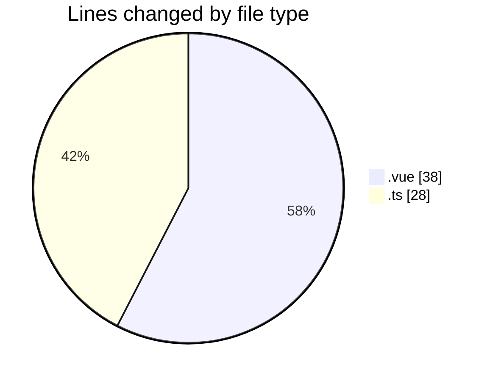
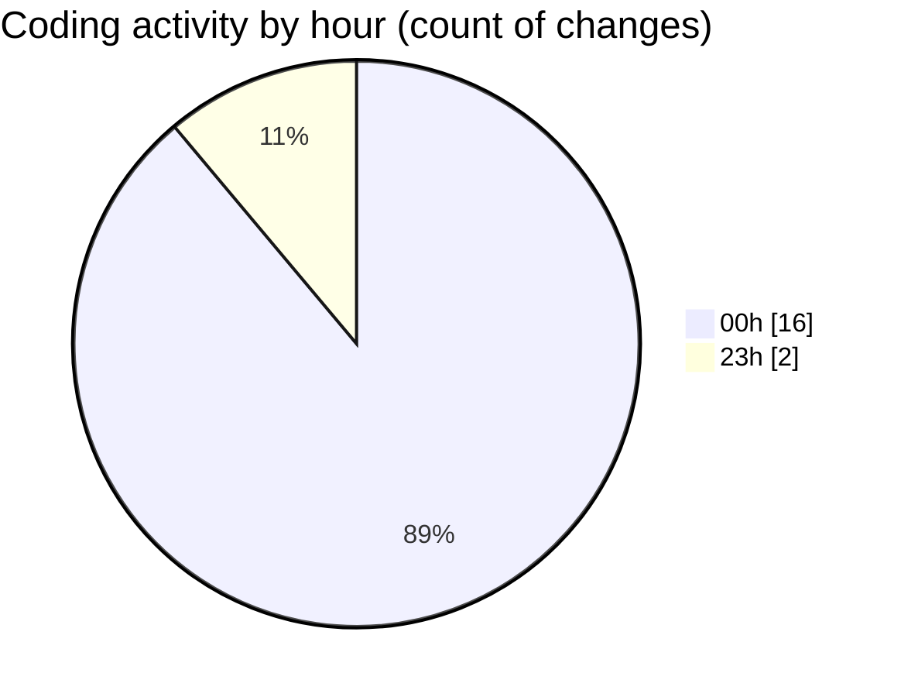

# rentOTP - Activity Summary 

## Overall Statistics

| Stat                   | Value                                                             |
| ---------------------- | ----------------------------------------------------------------- |
| **Lines Added** (➕)   | 30                                          |
| **Lines Removed** (➖) | 36                                        |
| **Net Change** (↕)    | -6                |
| **Active Time** (⌚)   | 24 minutes |

## Modified Files
- **Dashboard.vue** (+2, -23)
- **AdminSidebar.vue** (+0, -5)
- **ClientSidebar.vue** (+0, -5)
- **Client.vue** (+0, -3)
- **admin.service.ts** (+28, -0)

## Visualizations

### By File Type (Lines Changed)

### By Hour (Estimated Activity Count)

> **Last Updated:** 8/19/2025, 12:18:14 AM