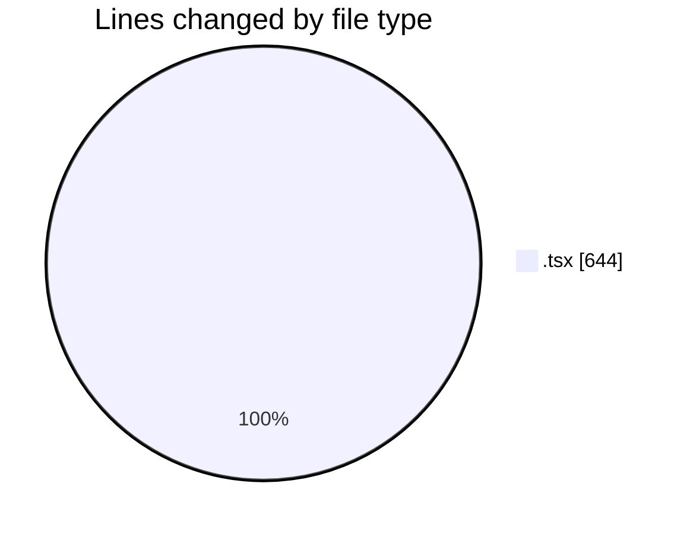
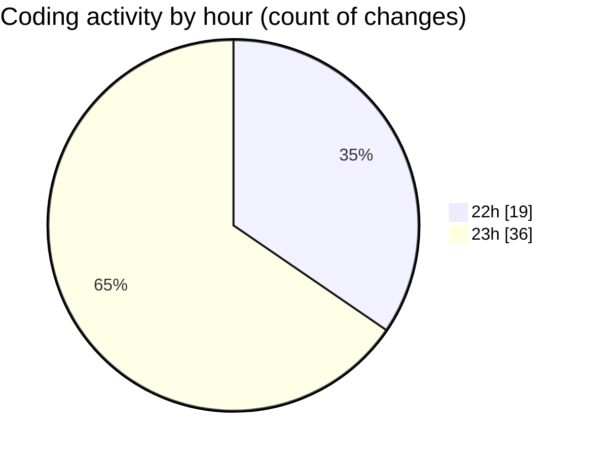

# napXUVN - Activity Summary 

## Overall Statistics

| Stat                   | Value                                                             |
| ---------------------- | ----------------------------------------------------------------- |
| **Lines Added** (➕)   | 506                                          |
| **Lines Removed** (➖) | 138                                        |
| **Net Change** (↕)    | 368                |
| **Active Time** (⌚)   | 53 minutes |

## Modified Files
- **money-icon.tsx** (+21, -13)
- **tiktok-icon.tsx** (+21, -13)
- **coin-icon.tsx** (+41, -33)
- **user-icon.tsx** (+21, -13)
- **shield-icon.tsx** (+21, -13)
- **market-icon.tsx** (+21, -13)
- **tools-icon.tsx** (+21, -13)
- **api-icon.tsx** (+21, -13)
- **sidebar.tsx** (+148, -0)
- **home-icon.tsx** (+22, -14)
- **layout.tsx** (+26, -0)
- **sidebar-item.tsx** (+41, -0)
- **card-transactions.tsx** (+81, -0)

## Visualizations

### By File Type (Lines Changed)

### By Hour (Estimated Activity Count)

> **Last Updated:** 8/20/2025, 11:48:55 PM