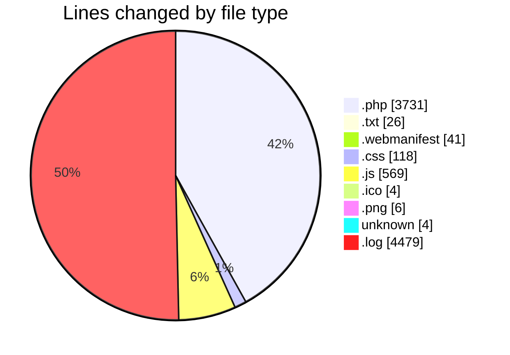
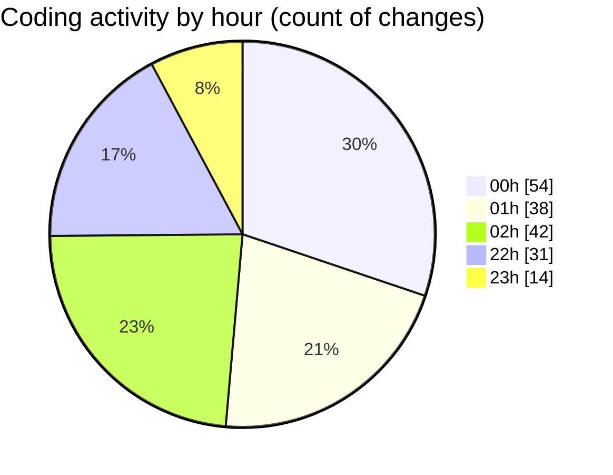

# quytuthien.vn - Activity Summary 

## Overall Statistics

| Stat                   | Value                                                             |
| ---------------------- | ----------------------------------------------------------------- |
| **Lines Added** (➕)   | 8522                                          |
| **Lines Removed** (➖) | 456                                        |
| **Net Change** (↕)    | 8066                |
| **Active Time** (⌚)   | 198 minutes |

## Modified Files
- **VirusScanService.php** (+82, -0)
- **RecaptchaService.php** (+64, -0)
- **GenerateSitemap.php** (+71, -0)
- **BackupDatabase.php** (+104, -0)
- **Kernel.php** (+66, -0)
- **seo-meta.blade.php** (+59, -6)
- **breadcrumb.blade.php** (+34, -0)
- **app.blade.php** (+168, -44)
- **Kernel.php** (+1, -0)
- **web.php** (+21, -0)
- **api.php** (+23, -0)
- **DonateRequest.php** (+83, -0)
- **DonateController.php** (+0, -31)
- **SecurityFeaturesTest.php** (+169, -0)
- **robots.txt** (+26, -0)
- **site.webmanifest** (+41, -0)
- **auth.php** (+60, -0)
- **AuthenticatedSessionController.php** (+49, -0)
- **RegisteredUserController.php** (+53, -0)
- **LoginRequest.php** (+86, -0)
- **EmailVerificationPromptController.php** (+24, -0)
- **VerifyEmailController.php** (+31, -0)
- **EmailVerificationNotificationController.php** (+28, -0)
- **ConfirmablePasswordController.php** (+45, -0)
- **PasswordController.php** (+33, -0)
- **PasswordResetLinkController.php** (+45, -0)
- **NewPasswordController.php** (+63, -0)
- **RouteServiceProvider.php** (+41, -0)
- **login.blade.php** (+48, -0)
- **register.blade.php** (+53, -0)
- **guest-layout.blade.php** (+59, -0)
- **application-logo.blade.php** (+4, -0)
- **input-label.blade.php** (+6, -0)
- **text-input.blade.php** (+4, -0)
- **input-error.blade.php** (+10, -0)
- **primary-button.blade.php** (+4, -0)
- **auth-session-status.blade.php** (+8, -0)
- **app.css** (+118, -0)
- **app.js** (+242, -106)
- **verify-email.blade.php** (+32, -0)
- **forgot-password.blade.php** (+26, -0)
- **reset-password.blade.php** (+40, -0)
- **confirm-password.blade.php** (+28, -0)
- **tailwind.config.js** (+49, -0)
- **home.blade.php** (+5, -0)
- **favicon.ico** (+4, -0)
- **favicon-16x16.png** (+2, -0)
- **favicon-32x32.png** (+2, -0)
- **apple-touch-icon.png** (+2, -0)
- **postcss.config.js** (+7, -0)
- **CampaignPageController.php** (+24, -0)
- **.env** (+2, -2)
- **ProfileController.php** (+61, -0)
- **ProfileUpdateRequest.php** (+24, -0)
- **edit.blade.php** (+26, -0)
- **update-profile-information-form.blade.php** (+65, -10)
- **update-password-form.blade.php** (+49, -10)
- **delete-user-form.blade.php** (+56, -0)
- **secondary-button.blade.php** (+4, -0)
- **danger-button.blade.php** (+4, -0)
- **modal.blade.php** (+66, -0)
- **notification.blade.php** (+79, -0)
- **notification-manager.blade.php** (+186, -70)
- **notification.js** (+96, -69)
- **test-notification.blade.php** (+68, -0)
- **manage_roles.php** (+87, -0)
- **IpAllowlistMiddleware.php** (+45, -0)
- **laravel.log** (+4479, -0)
- **test_admin.php** (+48, -0)
- **2025_08_20_222219_add_role_columns_to_users_table.php** (+32, -31)
- **User.php** (+118, -0)
- **AdminMiddleware.php** (+31, -0)
- **assign_admin_simple.php** (+41, -40)
- **test_admin_simple.php** (+39, -0)
- **2025_08_19_100050_add_permission_tables.php** (+1, -0)
- **2025_08_20_222626_create_complete_user_roles_system.php** (+76, -13)
- **check_columns.php** (+25, -24)
- **assign_admin_final.php** (+61, -0)
- **admin.blade.php** (+306, -0)

## Visualizations

### By File Type (Lines Changed)

### By Hour (Estimated Activity Count)

> **Last Updated:** 8/20/2025, 10:46:44 PM