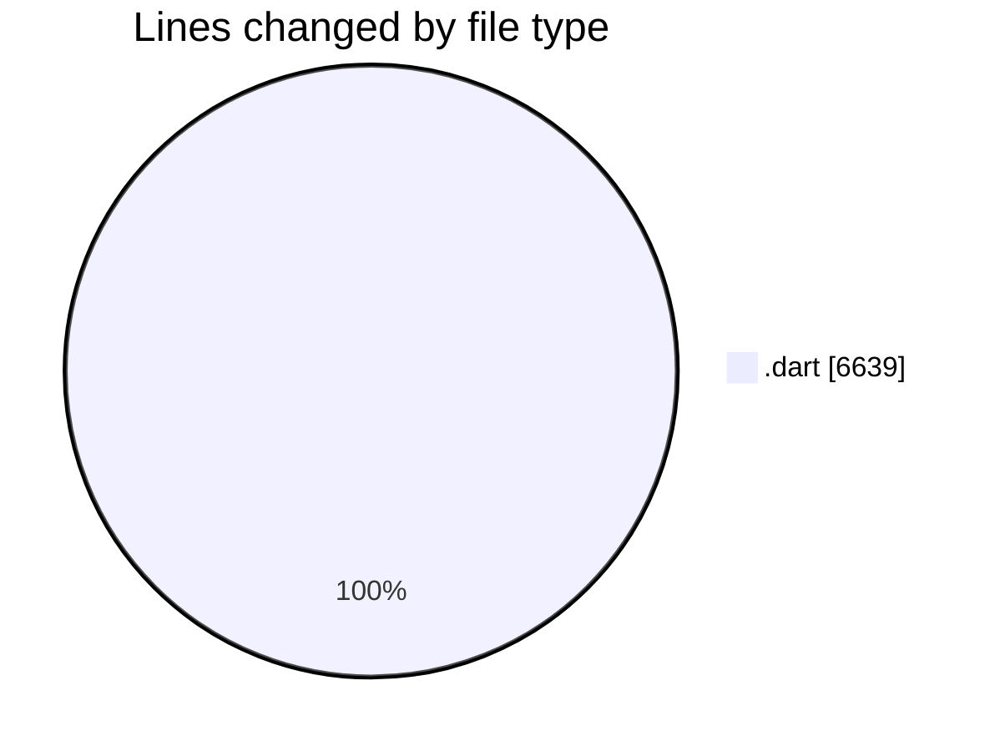
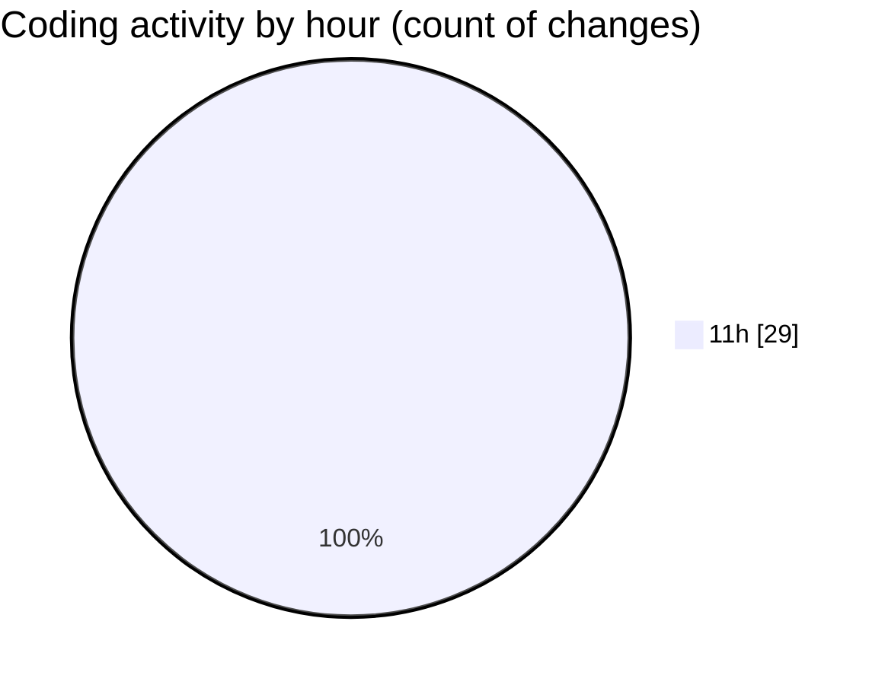

# studyBuddy - Activity Summary 

## Overall Statistics

| Stat                   | Value                                                             |
| ---------------------- | ----------------------------------------------------------------- |
| **Lines Added** (➕)   | 6574                                          |
| **Lines Removed** (➖) | 65                                        |
| **Net Change** (↕)    | 6509                |
| **Active Time** (⌚)   | 30 minutes |

## Modified Files
- **calendar_screen.dart** (+783, -65)
- **tasks_screen.dart** (+982, -0)
- **profile_screen.dart** (+1089, -0)
- **dashboard_screen.dart** (+797, -0)
- **main_screen.dart** (+280, -0)
- **onboarding_screen.dart** (+176, -0)
- **auth_provider.dart** (+238, -0)
- **event_provider.dart** (+249, -0)
- **study_target_provider.dart** (+304, -0)
- **subject_provider.dart** (+185, -0)
- **task_provider.dart** (+374, -0)
- **user_provider.dart** (+133, -0)
- **forgot_password_screen.dart** (+18, -0)
- **login_screen.dart** (+327, -0)
- **register_screen.dart** (+279, -0)
- **signup_screen.dart** (+360, -0)

## Visualizations

### By File Type (Lines Changed)

### By Hour (Estimated Activity Count)

> **Last Updated:** 8/25/2025, 11:56:00 AM