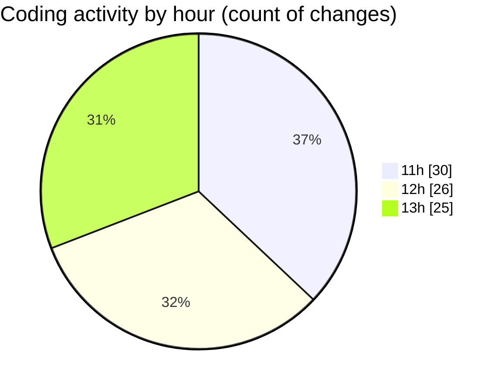

# studyBuddy - Activity Summary 

## Overall Statistics

| Stat                   | Value                                                             |
| ---------------------- | ----------------------------------------------------------------- |
| **Lines Added** (➕)   | 11190                                          |
| **Lines Removed** (➖) | 581                                        |
| **Net Change** (↕)    | 10609                |
| **Active Time** (⌚)   | 86 minutes |

## Modified Files
- **calendar_screen.dart** (+783, -65)
- **tasks_screen.dart** (+984, -0)
- **profile_screen.dart** (+1108, -0)
- **dashboard_screen.dart** (+797, -0)
- **main_screen.dart** (+280, -0)
- **onboarding_screen.dart** (+176, -0)
- **auth_provider.dart** (+287, -0)
- **event_provider.dart** (+249, -0)
- **study_target_provider.dart** (+304, -0)
- **subject_provider.dart** (+185, -0)
- **task_provider.dart** (+394, -0)
- **user_provider.dart** (+137, -33)
- **forgot_password_screen.dart** (+18, -0)
- **login_screen.dart** (+333, -0)
- **register_screen.dart** (+279, -0)
- **signup_screen.dart** (+371, -0)
- **calendar_screen.dart** (+18, -0)
- **tasks_screen.dart** (+18, -0)
- **notification_settings_screen.dart** (+514, -0)
- **security_settings_screen.dart** (+633, -0)
- **settings_screen.dart** (+230, -0)
- **sync_settings_screen.dart** (+522, -0)
- **splash_screen.dart** (+93, -0)
- **gradle.properties** (+5, -0)
- **empty_state.dart** (+204, -0)
- **firebase_auth_service.dart** (+469, -0)
- **build.gradle.kts** (+75, -0)
- **task_repository.dart** (+488, -57)
- **event_repository.dart** (+436, -26)
- **crud_demo_screen.dart** (+800, -400)

## Visualizations

### By File Type (Lines Changed)

### By Hour (Estimated Activity Count)

> **Last Updated:** 8/25/2025, 1:46:00 PM