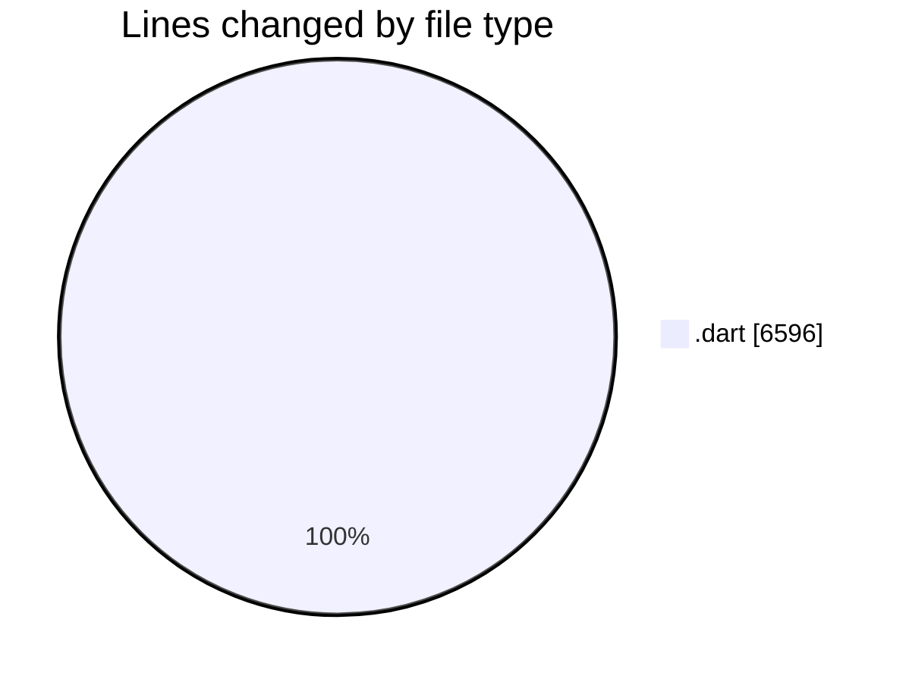
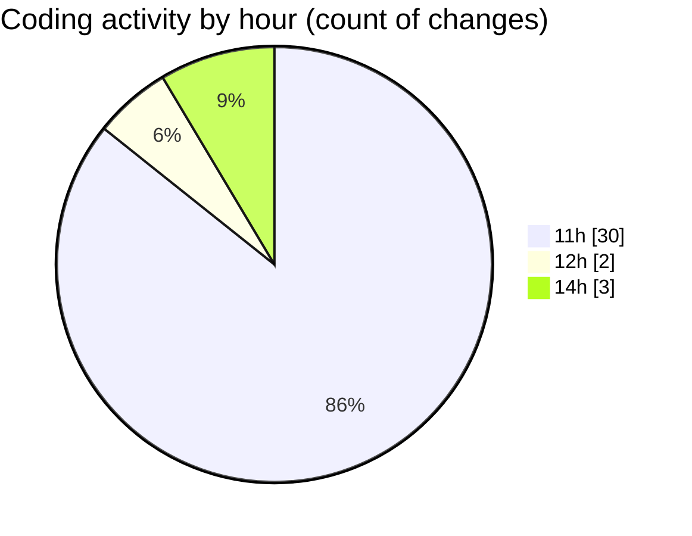

# studyBuddy - Activity Summary 

## Overall Statistics

| Stat                   | Value                                                             |
| ---------------------- | ----------------------------------------------------------------- |
| **Lines Added** (➕)   | 6571                                          |
| **Lines Removed** (➖) | 25                                        |
| **Net Change** (↕)    | 6546                |
| **Active Time** (⌚)   | 37 minutes |

## Modified Files
- **tasks_screen.dart** (+1040, -0)
- **settings_provider.dart** (+70, -0)
- **profile_screen.dart** (+1108, -0)
- **add_task_screen.dart** (+300, -0)
- **task_form_dialog.dart** (+448, -22)
- **notification_service.dart** (+780, -0)
- **task_model.dart** (+140, -0)
- **realtime_service.dart** (+262, -0)
- **event_repository.dart** (+410, -0)
- **user_repository.dart** (+133, -0)
- **main_screen.dart** (+393, -3)
- **task_repository.dart** (+441, -0)
- **task_local_storage.dart** (+146, -0)
- **signup_screen.dart** (+371, -0)
- **register_screen.dart** (+279, -0)
- **subject_form_dialog.dart** (+250, -0)

## Visualizations

### By File Type (Lines Changed)

### By Hour (Estimated Activity Count)

> **Last Updated:** 8/28/2025, 3:00:05 PM