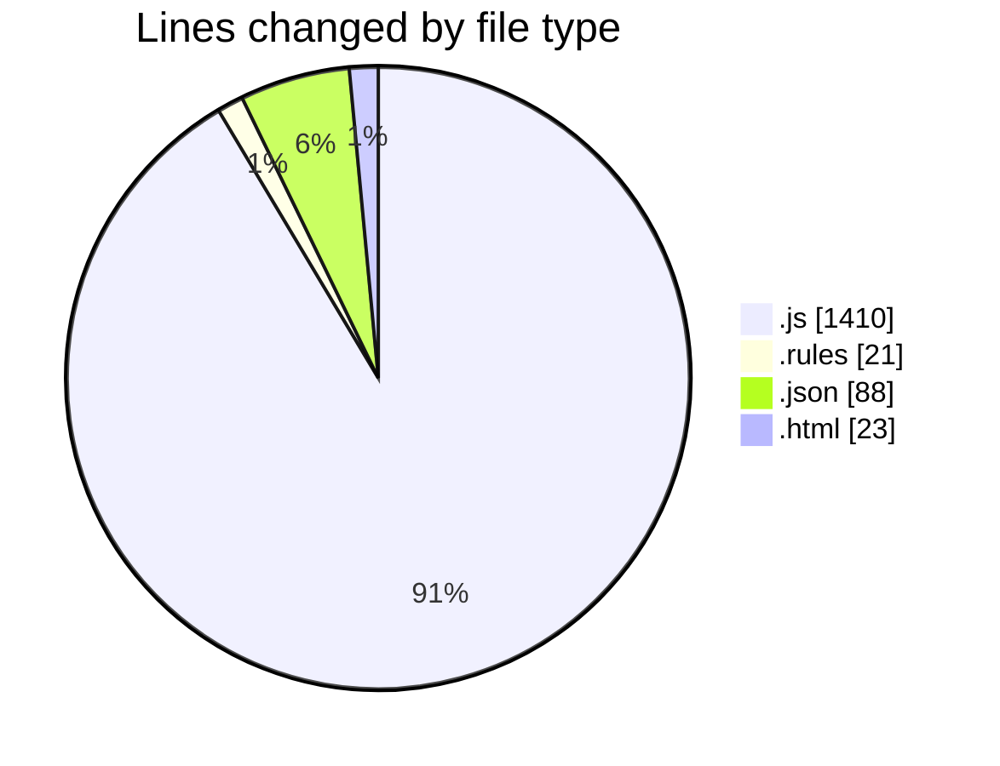
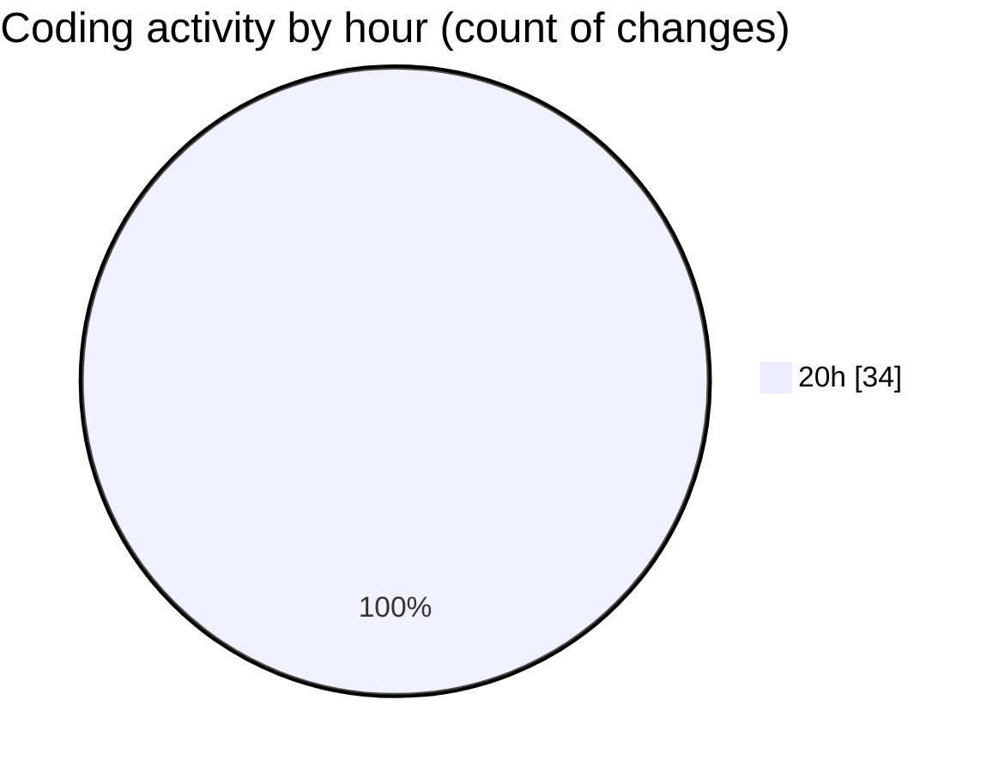

# 20m - Activity Summary 

## Overall Statistics

| Stat                   | Value                                                             |
| ---------------------- | ----------------------------------------------------------------- |
| **Lines Added** (➕)   | 1542                                          |
| **Lines Removed** (➖) | 0                                        |
| **Net Change** (↕)    | 1542                |
| **Active Time** (⌚)   | 33 minutes |

## Modified Files
- **firebase.js** (+25, -0)
- **firestore.rules** (+21, -0)
- **package.json** (+39, -0)
- **firebase.js** (+20, -0)
- **App.js** (+72, -0)
- **index.js** (+11, -0)
- **index.html** (+23, -0)
- **AuthContext.js** (+87, -0)
- **Login.js** (+125, -0)
- **Layout.js** (+151, -0)
- **Dashboard.js** (+220, -0)
- **AddYouTubeLink.js** (+202, -0)
- **EditYouTubeLink.js** (+202, -0)
- **package.json** (+49, -0)
- **firebase.js** (+22, -0)
- **App.js** (+80, -0)
- **HomeScreen.js** (+193, -0)

## Visualizations

### By File Type (Lines Changed)

### By Hour (Estimated Activity Count)

> **Last Updated:** 9/1/2025, 8:38:58 PM